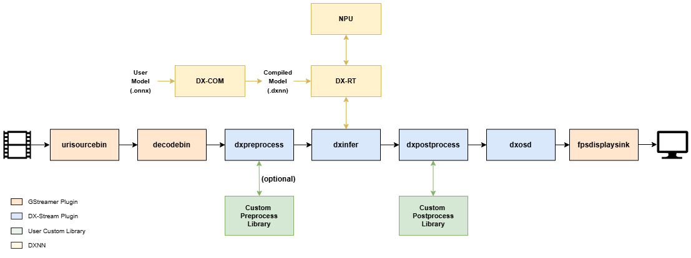

This chapter provides an overview of the DEEPX SDK architecture and explains each core component and its role in the AI development workflow.  

## DEEPX SDK Architecture  

**DEEPX SDK** is an all-in-one software development platform that streamlines the process of compiling, optimizing, simulating, and deploying AI inference applications on DEEPX NPUs (Neural Processing Units). It provides a complete toolchain, from AI model creation to runtime deployment, optimized for edge and embedded systems, enabling developers to build high-performance AI applications with minimal effort.  

**DX-COM** is the compiler in the DEEPX SDK that converts a pre-trained ONNX model and its associated configuration JSON file into a hardware-optimized .dxnn binary for DEEPX NPUs. The ONNX file contains the model structure and weights, while the JSON file defines pre/post-processing settings and compilation parameters. DX-COM provides a fully compiled .dxnn file, optimized for low-latency and high-efficient inference on DEEPX NPU.  

**DX-RT** is the runtime software responsible for executing ,dxnn models on DEEPX NPU hardware. DX-RT directly interacts with the DEEPX NPU through firmware and device drivers, using PCIe interface for high-speed data transfer between the host and the NPU, and provides C/C++ and Python APIs for application-level inference control. DX-RT offers a complete runtime environment, including model loading, I/O buffer management, inference execution, and real-time hardware monitoring.  

**DX ModelZoo** is a curated collection of pre-trained neural network models optimized for DEEPX NPU, designed to simplify AI development for DEEPX users. It includes pre-trained ONNX models, configuration JSON files, and pre-compiled DXNN binaries, allowing developers to rapidly test and deploy applications. DX ModelZoo also provides benchmark tools for comparing the performance of quantized INT8 models on DEEPX NPU with full-precision FP32 models on CPU or GPU.  

**DX-STREAM** is a custom GStreamer plugin that enables real-time streaming data integration into AI inference applications on DEEPX NPU. It provides a modular pipeline framework with configurable elements for preprocessing, inference, and postprocessing, tailored to vision AI work. DX-Stream allows developers to build flexible, high-performance applications for use cases such as video analytics, smart cameras, and edge AI systems.  

**DX-APP** is a sample application that demonstrates how to run compiled models on actual DEEPX NPU using DX-RT. It includes ready-to-use code for common vision tasks such as object detection, face recognition, and image classification. DX-APP helps developers quickly set up the runtime environment and serves as a template for building and customizing their own AI applications.  

---

## DX-STREAM Architecture

**DX-STREAM** provides dedicated Gstreamer elements for AI model inference on DEEPX NPU and includes auxiliary elements for developing AI applications.  
For most AI model processing, you can quickly build an inference environment by setting the properties of the elements provided by DX-Stream. In addition, we support processing through user-defined libraries in pre/post-processing for the user's unique model inference.  
This plugin-based architecture accelerates development and deployment while providing the flexibility needed for a wide range of vision AI applications, including object detection, multi-stream analysis, and real-time tracking.

---

## DX-STREAM Key Features

The following features highlight what makes DX-Stream a powerful and flexible framework for Vision AI application development.  

**Pipeline Modularity**  

DX-Stream divides the Vision AI data processing flow into discrete, functional units called Elements. Each element performs a specific task within a GStreamer pipeline, enabling modular, scalable, and reusable pipeline design.  

Elements  

- DxPreprocess – Performs input preprocessing for AI inference.
- DxInfer – Executes AI model inference using the DEEPX NPU.
- DxPostprocess – Processes and formats inference output.
- DxTracker – Tracks objects persistently across video frames.
- DxOsd – Overlays inference results onto video frames.
- DxGather – Merges multiple branched streams into a single unified stream.
- DxInputSelector - Selects one stream among multiple inputs based on PTS and forwards it to a single output.
- DxOutputSelector - Distributes a single input stream to multiple outputs based on predefined routing.
- DxRate – Controls the output frame rate of the stream.
- DxMsgConv – Converts inference results into structured messages.
- DxMsgBroker – Sends messages to external systems or networks.

**Inference Workflow**

The core inference process in DX-Stream follows this three-stage structure.  
- `DxPreprocess → DxInfer → DxPostprocess`

This three-stage pipeline enables seamless integration of AI model inference into multimedia streams while maintaining flexibility for diverse model architectures.

**Custom Library Support**

The **DxPreprocess** and **DxPostprocess** elements support user-defined custom libraries, allowing developers to integrate application-specific preprocessing and postprocessing logic into the pipeline. This makes it easy to adapt DX-Stream to diverse  AI models and deployment requirements.

**Efficient AI Inference**

The **DxInfer** element executes AI models using the DEEPX NPU, ensuring high-throughput and low-latency performance optimized for edge AI applications.  
Inference requires a model in `.dxnn` format, which is generated from an ONNX file using DX-COM.  

---

## DX-STREAM Model Workflow

The model workflow in **DX-STREAM** consists of three key stages, from model preparation to real-time inference on DEEPX NPU hardware.

**1. Model Compilation**  
DX-COM (Compiler) converts `.onnx` model files into .dxnn format, optimized for execution on DEEPX NPU hardware.

**2. Model Execution**  
The compiled `.dxnn` file is loaded onto the NPU.  
The host system uses **DX-RT** (Runtime) to  

- Allocate computation tasks to the NPU  
- Provide input tensors to the inference engine  
- Receive output tensors (inference results) from the NPU  

**3. Inference Process**  
All deep learning computations are offloaded to the NPU, ensuring high-performance and low-latency inference execution optimized for edge environments.  

---
