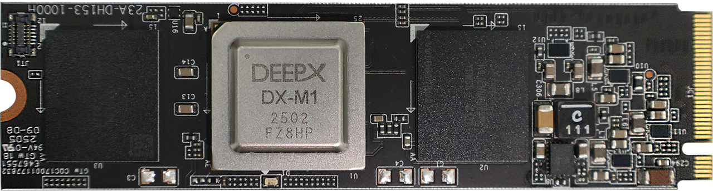

This chapter describes the installation of **DX-STREAM** in both source-based and Docker-based environments.

## System Requirements

This section describes the hardware and software requirements for running **DX-STREAM**.

**Hardware and Software Requirements**  

- **CPU:** amd64(x86_64), aarch64(arm64)
- **RAM:** 8GB RAM (16GB RAM or higher is recommended)
- **Storage:** 4GB or higher available disk space
- **OS:** Ubuntu 18.04 / 20.04 / 22.04 / 24.04 (x64)
          Debian 12 / Debian 13 (x64)
- **DX-RT must** be installed 3.0.0 or higher available 
- The system **must** support connection to an **M1 M.2** module with the M.2 interface on the host PC. 



!!! note "NOTE"

    The **NPU Device Driver** and **DX-RT** must be installed. For detailed instructions on installing NPU Device Driver and DX-RT, refer to **DX-RT User Manual**.

---

## Install DX-STREAM

**DX-STREAM** can be installed in two ways:

- **Standalone source build**: Build DX-STREAM independently from source code
- **DX-AS integrated build**: Build DX-STREAM as part of the DX-AS (DX All Suite) along with other DEEPX SDKs

**DX-AS** provides comprehensive environment management with version compatibility for all required dependencies (DX-RT, DX-Driver, DX-FW, etc.) and supports both Docker-based and local installation methods. For detailed information about DX-AS installation and integrated build options, please refer to the **DX-AS User Manual**.

This section focuses on the **standalone source build** approach for DX-STREAM only.

**1.** Clone the DEEPX-AI GitHub repository  

```
$ git clone https://github.com/DEEPX-AI/dx_stream.git
$ cd dx_stream
```

**2.** Install dependencies  

Run the provided script to automatically install all required packages.  
```
$ ./install.sh
```

**Optional Installation Options**  

You can selectively skip certain dependencies if they are already installed or not needed:

```bash
# Skip GStreamer installation
$ ./install.sh --wo-gst

# Skip OpenCV installation  
$ ./install.sh --wo-opencv

# Skip both GStreamer and OpenCV
$ ./install.sh --wo-gst --wo-opencv

# Show help message
$ ./install.sh --help
```

!!! note "NOTE"

    Use these options only if you have compatible versions already installed:

    - GStreamer 1.16.3 or higher
    - OpenCV 4.2.0 or higher


**3.** Build **DX-STREAM**  

    Compile **DX-STREAM**.  
    ```
    $ ./build.sh
    ```

    (Optional) Build with debug symbols.  
    ```
    $ ./build.sh --debug
    ```

**4.** Verify the installation  

Check that the plugin is correctly installed.  

```
$ gst-inspect-1.0 dxstream
```

!!! note "NOTE" 

    If you want to remove **DX-STREAM**, use the following command.  
    ```
    $ ./build.sh --uninstall
    ```

## Run DX-STREAM

This section provides a step-by-step guide of quickly running **DX-STREAM**'s sample pipelines

**Requirements**  
Before you start, ensure the following prerequisites are met.  

- Properly install **DX-RT**, **the NPU Device Driver**, and **DX-STREAM** in the correct order.
- Download the sample video and model needed to run the demo.

```
$ cd dx_stream
$ ./setup.sh
```

By running the above command, you can download the resources needed for the demo.


**Run Demo Pipelines**  

Execute the demo script.
```
$ cd dx_stream
$ ./run_demo.sh
```

When the script is executed, you'll be prompted to select a demo from the following options.
```
0: Object Detection (YOLOv5s)
1: Object Detection (YOLOv5s with PPU)
2: Face Detection (YOLOV5S_Face)
3: Face Detection (SCRFD500M with PPU)
4: Pose Estimation (YOLOV5Pose)
5: Pose Estimation (YOLOV5Pose with PPU)
6: Multi-Object Tracking
7: Semantic Segmentation
8: Multi-Channel Object Detection
9: Multi-Channel RTSP
-: secondary mode
which AI demo do you want to run:(timeout:10s, default:0)
```

Enter the number corresponding to the desired demo to run it.  

If **no** input is provided within 10 seconds, the default option (`0: Object Detection (YOLOv5s)`) will be executed automatically.

!!! note "NOTE" 

    Options with "PPU" suffix utilize **Post-Processing Unit (PPU)** acceleration, which performs model post-processing operations (such as bounding box decoding and score thresholding) directly on the NPU hardware instead of the CPU. This approach significantly improves inference performance by reducing CPU overhead.  

    Each demo corresponds to a specific pipeline described in **Chapter. Pipeline Example**.

---
