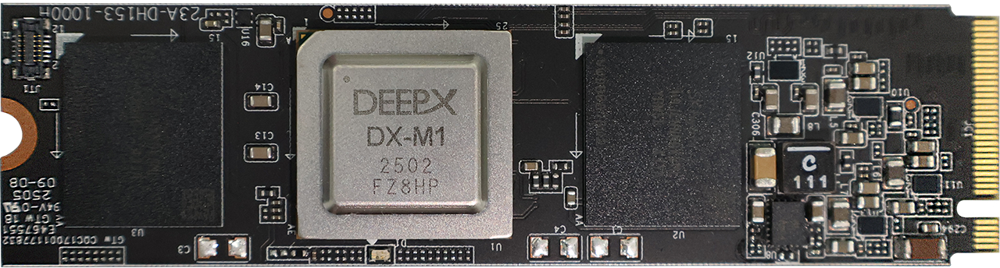

This chapter describes the installation of **DX-STREAM** in both source-based and Docker-based environments.

## System Requirements

This section describes the hardware and software requirements for running **DX-STREAM**.  

### Hardware and Software Requirements

- **CPU:** amd64(x86_64), aarch64(arm64)  
- **RAM:** 8GB RAM (16GB RAM or higher is recommended)  
- **Storage:** 4GB or higher available disk space  
- **OS:** Ubuntu 18.04 / 20.04 / 22.04 / 24.04 (x64)  
          Debian 12 / Debian 13 (x64)  
- **DX-RT must** be installed 3.0.0 or higher available  
- The system **must** support connection to an **M1 M.2** module with the M.2 interface on the host PC. 



!!! note "NOTE"

    The **NPU Device Driver** and **DX-RT** must be installed. For detailed instructions on installing NPU Device Driver and DX-RT, refer to **DX-RT User Manual**.

---

## Install DX-STREAM

**DX-STREAM** can be installed in two ways:

- **Standalone source build**: Build DX-STREAM independently from source code
- **DX-AllSuite integrated build**: Build DX-STREAM as part of the DX-AllSuite along with other DEEPX SDKs

**DX-AllSuite** provides comprehensive environment management with version compatibility for all required dependencies (DX-RT, DX-Driver, DX-FW, etc.) and supports both Docker-based and local installation methods. For detailed information about DX-AllSuite installation and integrated build options, please refer to the **DX-AllSuite User Manual**.

### Standalone Source Build

This section focuses on the **standalone source build** approach for DX-STREAM only.

#### **Step 1.** Clone the DEEPX-AI GitHub repository  

```
$ git clone https://github.com/DEEPX-AI/dx_stream.git
$ cd dx_stream
```

#### **Step 2.** Install dependencies  

Run the provided script to automatically install all required packages.  
```
$ ./install.sh
```

**Optional Installation Options**  

You can selectively skip certain dependencies if they are already installed or not needed:

```bash
# Skip GStreamer installation
$ ./install.sh --wo-gst

# Skip OpenCV installation  
$ ./install.sh --wo-opencv

# Skip both GStreamer and OpenCV
$ ./install.sh --wo-gst --wo-opencv

# Show help message
$ ./install.sh --help
```

!!! note "NOTE"

    Use these options only if you have compatible versions already installed:  

    - GStreamer 1.16.3 or higher  
    - OpenCV 4.2.0 or higher  

####  **Step 3.** Build & Environment **DX-STREAM**

**(1) Build & Installation**  

Compile **DX-STREAM** with the default installation prefix (`/usr/local`) or customize the build using available options.  

```bash
$ ./build.sh
```

**Available Build Options**  

The build script supports various options for customization and maintenance:

```bash
# Install to custom location
$ ./build.sh --prefix=/opt/dx-stream

# Install to relative path (automatically converted to absolute)
$ ./build.sh --prefix=./install

# Build with debug symbols
$ ./build.sh --type=debug

# Clean previous build files before building
$ ./build.sh --clean

# Build for DEEPX V3 Standalone Device
$ ./build.sh --v3

# Combine flags
$ ./build.sh --v3 --type=debug

# Uninstall DX-STREAM
$ ./build.sh --uninstall

# Uninstall from custom location
$ ./build.sh --uninstall --prefix=/opt/dx-stream

# Show all available options
$ ./build.sh --help
```

**Installation Structure**  

By default, DX-STREAM is installed to `/usr/local` with the following structure:

- Plugin: `/usr/local/lib/<arch>/gstreamer-1.0/libgstdxstream.so`
- Headers: `/usr/local/include/gstdxstream/`
- Custom libraries: `/usr/local/share/gstdxstream/lib/`
- Applications: `/usr/local/share/gstdxstream/bin/`
- pkg-config: `/usr/local/lib/pkgconfig/gstdxstream.pc`

You can change the installation location using `--prefix` option. When using a custom prefix, all paths will be adjusted accordingly.

**(2) How to Apply Environment**  

The build script **automatically adds** required environment variables to your `~/.bashrc` during installation. After installation completes, choose one of the following to apply the changes :  

Step A. **Open a new terminal**: The changes will be applied automatically in any new session.  

Step B. **Reload your current shell**: To use the changes in the current terminal, run.  
   ```bash
   $ source ~/.bashrc
   ```

Step C. **Check recognition**: Check if the plugin is correctly recognized by GStreamer.  
   ```bash
   $ gst-inspect-1.0 dxstream
   ```

!!! note "Standard Installation (`/usr/local` or `/usr`)"

    Environment variables are added to `~/.bashrc`, but the system can often find the plugin automatically:  
    
    - pkg-config searches `/usr/local/lib/pkgconfig` by default  
    - GStreamer searches standard plugin directories automatically  
    
    If the plugin is not found, clear GStreamer cache:  
    ```bash
    $ rm -rf ~/.cache/gstreamer-1.0/
    $ gst-inspect-1.0 dxstream
    ```

!!! note "Custom Prefix Installation"

    **Using custom prefix (e.g., `./install`, `/opt/dx-stream`):**  
    
    The build script automatically configures all required environment variables in your `~/.bashrc`:  
    
    - `PKG_CONFIG_PATH` - For building projects that depend on gstdxstream  
    - `GST_PLUGIN_PATH` - For GStreamer plugin discovery  
    - `LD_LIBRARY_PATH` - For runtime library loading  
    - `PATH` - For DX-Stream executables
    
    **For immediate use** in the current terminal (before opening a new one):  
    ```bash
    $ source ~/.bashrc
    ```
    
    Or set them manually for the current session:
    ```bash
    $ export PKG_CONFIG_PATH="/path/to/install/lib/pkgconfig:${PKG_CONFIG_PATH}"
    $ export GST_PLUGIN_PATH="/path/to/install/lib/x86_64-linux-gnu/gstreamer-1.0:${GST_PLUGIN_PATH}"
    $ export LD_LIBRARY_PATH="/path/to/install/lib/x86_64-linux-gnu/gstreamer-1.0:/path/to/install/share/gstdxstream/lib:${LD_LIBRARY_PATH}"
    $ export PATH="/path/to/install/share/gstdxstream/bin:${PATH}"
    ```

**(3) Environment Variable Reference**  

Each variable serves a different purpose during build-time and runtime:  

| Variable | Purpose | When Needed |
|----------|---------|-------------|
| `PKG_CONFIG_PATH` | Lets pkg-config find `.pc` files | **Build-time** (when compiling against gstdxstream) |
| `GST_PLUGIN_PATH` | Tells GStreamer where plugins are | **Runtime** (when running pipelines) |
| `LD_LIBRARY_PATH` | Dynamic linker finds `.so` files | **Runtime** (when loading shared libraries) |
| `PATH` | Executable lookup | **Runtime** (when running DX-Stream apps) |

!!! note "Best Practice"
    
    - For **production deployments**: Use standard prefix (`/usr/local`)
    - For **development**: Use custom prefix (e.g., `./install`) to avoid requiring sudo
    - For **CI/CD**: Set environment variables explicitly in your scripts

#### **Step 4.** Final Verification  

Check that the plugin is correctly installed:  

```bash
$ gst-inspect-1.0 dxstream
```

You should see the plugin details including available elements (dxpreprocess, dxinfer, dxpostprocess, dxscale, dxconvert, etc.).  

!!! warning "Troubleshooting"

    **If `gst-inspect-1.0 dxstream` fails with "No such element or plugin":**

    - (1) **Clear GStreamer cache** (most common fix):
       ```bash
       $ rm -rf ~/.cache/gstreamer-1.0/
       $ gst-inspect-1.0 dxstream
       ```

    - (2) **Verify plugin file exists:**
       ```bash
       # For standard installation
       $ ls -la /usr/local/lib/x86_64-linux-gnu/gstreamer-1.0/libgstdxstream.so
       
       # For custom installation
       $ ls -la /path/to/install/lib/x86_64-linux-gnu/gstreamer-1.0/libgstdxstream.so
       ```

    - (3) **For custom prefix installations**, check environment variables:
       ```bash
       $ echo $GST_PLUGIN_PATH
       # Should include: /path/to/install/lib/.../gstreamer-1.0
       ```

    - (4) **Set GST_PLUGIN_PATH manually** (temporary):
       ```bash
       $ export GST_PLUGIN_PATH="/usr/local/lib/x86_64-linux-gnu/gstreamer-1.0:${GST_PLUGIN_PATH}"
       $ gst-inspect-1.0 dxstream
       ```

#### **Uninstalling DX-STREAM**  

To remove DX-STREAM from your system:  

```bash
# Uninstall from default location (/usr/local)
$ ./uninstall.sh

# Or use build.sh
$ ./build.sh --uninstall

# Uninstall from custom location
$ ./build.sh --uninstall --prefix=/opt/dx-stream
```

The uninstall process automatically removes:  

- GStreamer plugin (`libgstdxstream.so`)
- Header files (`include/gstdxstream/`)
- Custom libraries and applications (`share/gstdxstream/`)
- pkg-config file (`gstdxstream.pc`)
- **Environment variables from `~/.bashrc`** (automatic cleanup)

!!! note "Automatic Cleanup"

    The uninstall script **automatically removes** DX-STREAM environment variables from your `~/.bashrc`. After uninstalling:
    
    - (1) Open a new terminal, or
    - (2) Reload your shell:
       ```bash
       $ source ~/.bashrc
       ```
    
    No manual editing of configuration files is required!

---

## Run DX-STREAM

This section provides a step-by-step guide of quickly running **DX-STREAM**'s sample pipelines

### Requirements  

Before you start, ensure the following prerequisites are met.  

- Properly install **DX-RT**, **the NPU Device Driver**, and **DX-STREAM** in the correct order.  
- Download the sample video and model needed to run the demo.  

```
$ cd dx_stream
$ ./setup.sh
```

By running the above command, you can download the resources needed for the demo.

### Run Demo Pipelines  

Execute the demo script.
```
$ cd dx_stream
$ ./run_demo.sh
```

When the script is executed, you'll be prompted to select a demo from the following options.
```
0: Object Detection (YOLOv26n)
1: Object Detection (YOLOv5s with PPU)
2: Face Detection (YOLOv5s_Face)
3: Face Detection (SCRFD500M with PPU)
4: Pose Estimation (YOLOv26n_Pose)
5: Pose Estimation (YOLOV5Pose with PPU)
6: Instance Segmentation (YOLOv26n_Seg)
7: Multi-Object Tracking
8: Multi-Channel Object Detection
9: Multi-Channel Object Detection (RTSP)
-: secondary mode
which AI demo do you want to run:(timeout:10s, default:0)
```

Enter the number corresponding to the desired demo to run it.  

If **no** input is provided within 10 seconds, the default option (`0: Object Detection (YOLOv26n)`) will be executed automatically.

!!! note "NOTE" 

    Options with "PPU" suffix utilize **Post-Processing Unit (PPU)** acceleration, which performs model post-processing operations (such as bounding box decoding and score thresholding) directly on the NPU hardware instead of the CPU. This approach significantly improves inference performance by reducing CPU overhead.  

    Each demo corresponds to a specific pipeline described in **Chapter. Pipeline Example**.

!!! warning "Third-Party Model License Notice"

    Sample models included in DX-STREAM are provided for **evaluation and development purposes only** and are **not licensed for commercial deployment**. Most models are subject to AGPL-3.0, GPL-3.0, or non-commercial research licenses. For commercial use, users must obtain appropriate licenses from the original model providers or use their own commercially licensed models. See [Third-Party Sample Model Licenses](Appendix_Third_Party_Model_Licenses.md) for details.

---
