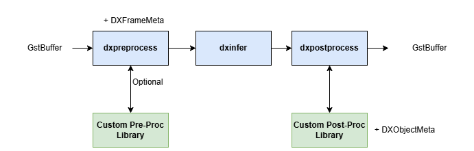

This chapter  describes how to integrate a custom AI model and implement user-defined logic within the **DX-STREAM** pipeline. It assumes that your model has already been compiled into `.dxnn` format using **DX-COM**. For details on model compilation, refer to **DX-COM User Manual**.  

This guide focuses on how to configure and integrate custom logic into the **DX-STREAM** pipeline using modular elements such as **DxPreprocess, DxInfer,** and **DxPostprocess**.

## Custom Library for Model Inference  



The **DX-STREAM** inference pipeline is composed of the following elements.  

**DxPreprocess**  

- Allocates `DXFrameMeta` based on the `GstBuffer` received from upstream.  
- Performs the preprocessing algorithm as defined by elements properties.  
- For custom preprocessing algorithms, a **Custom Pre-Process Library** can be built and integrated.  
- See the **dxpreprocess** section in the Elements documentation for details.  

**DxPostprocess**  

- Receives the input tensor created by `dxpreprocess`.  
- Performs inference using the `dxinfer` element (**DX-RT**).  
- Access the output tensor from `dxinfer` and executes the custom postprocessing algorithm defined in a custom library.  
- A custom postprocessing implementation is required for each model.  
- Example libraries for common vision tasks can be found in `dx_stream/custom_library/postprocess_library`.  

### **Writing Custom Pre-Process Function**
For models requiring additional preprocessing beyond the default functionality, you can implement a **Custom Pre-Process Function** using a user-defined library.  

#### **Implementation Example**  
```
extern "C" void CustomPreprocessFunc(DXFrameMeta *frame_meta, DXObjectMeta *object_meta, void* input_tensor) 
{
    // Preprocessing logic
}
```

**DXFrameMeta**  

- Access the original buffer through `frame_meta -> _buf` and create an input image by copying the buffer.  

**DXObjectMeta**  

- In **Secondary Mode**, metadata for each object is passed to the function.  
- In **Primary Mode**, no object metadata is available. (`nullptr`)  

**input_tensor**

- The address of the input tensor generated through user-defined preprocessing.
- It is pre-allocated based on the input tensor size specified by the `dxpreprocess` property and passed to the user. Therefore, users **must not** free or reallocate this memory.

#### **Library Integration** 
To build the custom object library, use a `meson.build` file and compile as follows.

```
dx_stream_dep = declare_dependency(
    include_directories : include_directories('/usr/local/include/dx_stream'),
    link_args : ['-L/usr/local/lib', '-lgstdxstream'],
)

gst_dep = dependency('gstreamer-1.0', version : '>=1.14',
    required : true, fallback : ['gstreamer', 'gst_dep'])

opencv_dep = dependency('opencv4', required: true)

libcustompreproc = shared_library('custompreproc', 
    'preprocess.cpp',
    dependencies: [opencv_dep, gst_dep, dx_stream_dep],
    install: true,
    install_dir: plugins_install_dir + '/lib'
)
```

Specify the library path and function name in the JSON configuration file for `dxpreprocess` as follows.
```
{
    "library_file_path": "./install/gstreamer-1.0/lib/libcustompreproc.so",
    "function_name": "CustomPreprocessFunc"
}
```

### **Writing Custom Post-Process Function**  
Postprocessing is essential for interpreting and converting the model’s output tensor into meaningful results. To do this, a custom post-process library **must** be implemented to match your model’s architecture and output format. 

#### **Output Tensor Parsing**  
To check the structure of the output tensor, use the following command. This prints the tensor shape for each output.  

```
$ parse_model -m YOLOv7.dxnn

Example output:

outputs:
  onnx::Reshape_491, FLOAT, [1, 80, 80, 256]
  onnx::Reshape_525, FLOAT, [1, 40, 40, 256]
  onnx::Reshape_559, FLOAT, [1, 20, 20, 256]
```

The example shows three blobs with NHWC dimensions. Use this information to implement the custom postprocessing logic.

#### **Implementation Example**  

```
extern "C" void YOLOV7(std::vector<dxs::DXTensor> network_output,
                       DXFrameMeta *frame_meta, DXObjectMeta *object_meta)
{
    // Convert output tensor to bounding box information
}
```

#### **Library Integration**  
Build the custom library using a `meson.build` script.

```
project('postprocess_yolov5s', 'cpp', version : '1.0.0', license : 'LGPL', default_options: ['cpp_std=c++11'])

dx_stream_dep = declare_dependency(
    include_directories : include_directories('/usr/local/include/dx_stream'),
    link_args : ['-L/usr/local/lib', '-lgstdxstream'],
)

gst_dep = dependency('gstreamer-1.0', version : '>=1.14',
    required : true, fallback : ['gstreamer', 'gst_dep'])

opencv_dep = dependency('opencv4', required: true)

yolo_postprocess_lib = shared_library('postprocess_yolo', 
    'postprocess.cpp',
    dependencies: [opencv_dep, gst_dep, dx_stream_dep, dxrt_dep],
    install: true,
    install_dir: '/usr/share/dx-stream/lib'
)
```

Specify the library path and function name in the JSON configuration file for `dxpostprocess` as follows.  

```
{
    "library_file_path": "./install/gstreamer-1.0/lib/libyolo_postprocess.so",
    "function_name": "yolo_post_process"
}
```

### **Differences in Post-Processing Logic Based on Inference Mode**  

**Primary Mode**  

- Inference is performed on the entire frame.  
- Postprocessing is responsible for creating new objects (`DXObjectMeta`) based on the model’s output.  
- These new objects are then added to the associated `DXFrameMeta`.  

**Secondary Mode**  

- Inference is performed per object, based on existing metadata.  
- Postprocessing is applied to modify or enrich existing object metadata.  
- The `DxObjectMeta` structure contains the input object information, which is passed to the postprocess function for update or enhancement.  

---

## Custom Message Convert Library  

Custom message conversion in **DX-STREAM** requires implementing a user-defined library that converts inference metadata into the desired message format.

#### **Functions to Implement**  
Your custom library **must** define the following four functions.  

- `dxmsg_create_context`: Initializes the message conversion context using the provided configuration file  
- `dxmsg_delete_context`: Deletes and releases all resources associated with the context  
- `dxmsg_convert_payload`: Converts the metadata into the target message format  
- `dxmsg_release_payload`: Releases all resources used by the generated payload  

#### **Implementation Example**  

```
#include "dx_msgconvl_priv.hpp"

extern "C" DxMsgContext *dxmsg_create_context(const gchar *file) {
    DxMsgContext *context = g_new0(DxMsgContext, 1);
    context->_priv_data = (void *)dxcontext_create_contextPriv();
    dxcontext_parse_json_config(file, (DxMsgContextPriv *)context->_priv_data);
    return context;
}

extern "C" void dxmsg_delete_context(DxMsgContext *context) {
    dxcontext_delete_contextPriv((DxMsgContextPriv *)context->_priv_data);
    g_free(context);
}

extern "C" DxMsgPayload *dxmsg_convert_payload(DxMsgContext *context, DxMsgMetaInfo *meta_info) {
    DxMsgPayload *payload = g_new0(DxMsgPayload, 1);
    gchar *json_data = dxpayload_convert_to_json(context, meta_info);
    payload->_size = strlen(json_data);
    payload->_data = json_data;
    return payload;
}

extern "C" void dxmsg_release_payload(DxMsgContext *context, DxMsgPayload *payload) {
    g_free(payload->_data);
    g_free(payload);
}
```

#### **Library Integration**  
Build the custom library.

```
custom_msgconv_lib = shared_library('custom_msgconv', 
    'dx_msgconvl.cpp',
    include_directories: [include_directories('.')],
    install: true,
    install_dir: '/opt/dx_stream/msgconv/lib'
)
```

---
