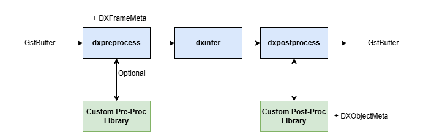

This chapter  describes how to integrate a custom AI model and implement user-defined logic within the **DX-STREAM** pipeline. It assumes that your model has already been **Differences in Post-Processing Logic Based on Inference Mode**  

**Primary Mode**  

- Inference is performed on the entire frame.  
- Postprocessing is responsible for creating new objects (`DXObjectMeta`) based on the model's output.  
- Use `dx_acquire_obj_meta_from_pool()` to create new objects and `dx_add_obj_meta_to_frame()` to add them to the frame.
- These new objects are then added to the associated `DXFrameMeta`.  

**Secondary Mode**  

- Inference is performed per object, based on existing `DXObjectMeta` in buffer.  
- Postprocessing is applied to modify or enrich existing object metadata.  
- The `DxObjectMeta` structure contains the input object information, which is passed to the postprocess function for update or enhancement.  

**API Migration Notes:**  

- The `frame_meta->_buf` member has been removed to eliminate circular references.
- All functions now receive `GstBuffer *buf` as the first parameter for direct buffer access.
- Object creation has changed from `dx_create_object_meta(buf)` to `dx_acquire_obj_meta_from_pool()`.
- Use `dx_add_obj_meta_to_frame()` to add objects to frame metadata.
- Custom libraries must be updated to use the new function signatures.to `.dxnn` format using **DX-COM**. For details on model compilation, refer to **DX-COM User Manual**.  

This guide focuses on how to configure and integrate custom logic into the **DX-STREAM** pipeline using modular elements such as **DxPreprocess, DxInfer,** and **DxPostprocess**.

## DX-STREAM Metadata System Overview

DX-STREAM provides a comprehensive metadata framework for handling inference results and custom data throughout the pipeline. The system is designed with a hierarchical structure that enables efficient data organization and access.

### **Metadata Architecture**

DX-STREAM uses a hierarchical metadata structure that follows this organization:

**Buffer → Frame → Object → User Meta**

- **GstBuffer**: Contains video frame data and top-level frame metadata
- **DXFrameMeta**: Frame-level metadata (dimensions, stream info, object list)
- **DXObjectMeta**: Object-level metadata (detection results, features)
- **DXUserMeta**: User-defined custom metadata attached to frames or objects

### **Core Metadata Types**

**DXFrameMeta Structure:**
```cpp
struct _DXFrameMeta {
    GstMeta _meta;
    
    int _stream_id;
    int _width;
    int _height;
    std::string _format;
    std::string _name;
    float _frame_rate;

    int _roi[4];

    // segmentation
    std::vector<unsigned char> _seg_data;
    int _seg_width = 0;
    int _seg_height = 0;

    // classification result (primary mode)
    int _label;
    std::string _label_name;
    float _label_confidence;

    std::vector<DXObjectMeta*> _object_meta_list;

    std::vector<DXUserMeta*> _frame_user_meta_list;

    // RAII-managed tensors (shallow copy through shared_ptr)
    std::map<int, dxs::DXTensors> _input_tensors;   // preproc_id -> input tensors
    std::map<int, dxs::DXTensors> _output_tensors;   // infer_id -> output tensors
};
```

**DXObjectMeta Structure:**
```cpp
struct _DXObjectMeta {
    int _meta_id;

    // body
    int _track_id;
    int _label;
    std::string _label_name;
    float _confidence;
    std::array<float, 4> _box;
    std::vector<float> _keypoints;
    std::vector<float> _body_feature;

    // oriented bounding box [cx, cy, w, h, angle]
    std::vector<float> _obb;

    // face
    std::array<float, 4> _face_box;
    float _face_confidence;
    std::vector<float> _face_landmarks;
    std::vector<float> _face_feature;

    // segmentation
    std::vector<unsigned char> _seg_data;
    int _seg_width = 0;
    int _seg_height = 0;

    // user meta
    std::vector<DXUserMeta*> _obj_user_meta_list;

    // RAII-managed tensors (shallow copy through shared_ptr)
    std::map<int, dxs::DXTensors> _input_tensors;   // preproc_id -> input tensors
    std::map<int, dxs::DXTensors> _output_tensors;   // infer_id -> output tensors

};
```

**Segmentation Note:**

- `DXFrameMeta._seg_data`, `_seg_width`, and `_seg_height` store a frame-level semantic class map.
- `DXObjectMeta._seg_data`, `_seg_width`, and `_seg_height` store an ROI-local binary mask aligned to `_box`.
- Legacy `SegClsMap` is no longer used for object metadata.

### **Metadata API Functions**

**Frame Metadata Operations:**
```cpp
// Create and access frame metadata
GstBuffer *dx_create_frame_meta(GstBuffer *buffer);
DXFrameMeta *dx_get_frame_meta(GstBuffer *buffer);

// Object management in frame
gboolean dx_add_obj_meta_to_frame(DXFrameMeta *frame_meta, DXObjectMeta *obj_meta);
gboolean dx_remove_obj_meta_from_frame(DXFrameMeta *frame_meta, DXObjectMeta *obj_meta);
```

**Object Metadata Operations:**
```cpp
// Object lifecycle management
DXObjectMeta* dx_acquire_obj_meta_from_pool(void);
void dx_release_obj_meta(DXObjectMeta *obj_meta);
void dx_copy_obj_meta(DXObjectMeta *src_meta, DXObjectMeta *dst_meta);
```

**User Metadata Operations:**
```cpp
// User metadata lifecycle
DXUserMeta* dx_acquire_user_meta_from_pool(void);
void dx_release_user_meta(DXUserMeta *user_meta);

// Data management with required safety functions
gboolean dx_user_meta_set_data(DXUserMeta *user_meta, 
                              gpointer data, 
                              gsize size, 
                              DXUserMetaType meta_type, 
                              GDestroyNotify release_func,    // Required: cleanup function
                              GBoxedCopyFunc copy_func);      // Required: copy function

// Attachment to frame/object
gboolean dx_add_user_meta_to_frame(DXFrameMeta *frame_meta, DXUserMeta *user_meta);
gboolean dx_add_user_meta_to_obj(DXObjectMeta *obj_meta, DXUserMeta *user_meta);

// Retrieval (returns std::vector pointer)
std::vector<DXUserMeta*>* dx_get_frame_user_metas(DXFrameMeta *frame_meta);
std::vector<DXUserMeta*>* dx_get_object_user_metas(DXObjectMeta *obj_meta);
```

## Custom Library for Model Inference  



The **DX-STREAM** inference pipeline is composed of the following elements.  

**DxPreprocess**  

- Allocates `DXFrameMeta` based on the `GstBuffer` received from upstream.  
- Performs the preprocessing algorithm as defined by elements properties.  
- For custom preprocessing algorithms, a **Custom Pre-Process Library** can be built and integrated.  
- See the **dxpreprocess** section in the Elements documentation for details.  

**DxPostprocess**  

- Receives the input tensor created by `dxpreprocess`.  
- Performs inference using the `dxinfer` element (**DX-RT**).  
- Access the output tensor from `dxinfer` and executes the custom postprocessing algorithm defined in a custom library.  
- A custom postprocessing implementation is required for each model.  
- Example libraries for common vision tasks can be found in `dx_stream/custom_library/postprocess_library`.  

### **DX-STREAM Metadata Architecture**

DX-STREAM uses a hierarchical metadata structure that follows this organization:

**Buffer → Frame → Object → User Meta**

- **GstBuffer**: Contains video frame data and top-level frame metadata
- **DXFrameMeta**: Frame-level metadata (dimensions, stream info, object list)
- **DXObjectMeta**: Object-level metadata (detection results, features)
- **DXUserMeta**: User-defined custom metadata attached to frames or objects

#### **Using User Meta System**

The DX-STREAM framework provides a simplified user metadata system for storing custom data. The system supports two main categories of user metadata:

**User Meta Types:**
```cpp
enum class DXUserMetaType {
    DX_USER_META_FRAME = 0x1000,   // Frame-level user metadata
    DX_USER_META_OBJECT = 0x2000,  // Object-level user metadata
};
```

**DXUserMeta Structure:**
```cpp
struct _DXUserMeta {
    gpointer user_meta_data;        // Pointer to user data
    gsize user_meta_size;           // Size of user data
    DXUserMetaType user_meta_type;  // Type (FRAME or OBJECT)
    
    GDestroyNotify release_func;    // Required: data cleanup function
    GBoxedCopyFunc copy_func;       // Required: data copy function
};
```

**Adding Custom Metadata to Frame:**
```cpp
// Define custom data structure
typedef struct {
    gint custom_id;
    gchar *custom_name;
    gfloat custom_score;
} MyFrameData;

// Copy function for your data
static gpointer my_frame_data_copy(gconstpointer src) {
    const MyFrameData *src_data = (const MyFrameData *)src;
    MyFrameData *dst_data = g_new0(MyFrameData, 1);
    dst_data->custom_id = src_data->custom_id;
    dst_data->custom_name = g_strdup(src_data->custom_name);
    dst_data->custom_score = src_data->custom_score;
    return dst_data;
}

// Cleanup function for your data
static void my_frame_data_free(gpointer data) {
    MyFrameData *frame_data = (MyFrameData *)data;
    g_free(frame_data->custom_name);
    g_free(frame_data);
}

// Create and set user metadata
DXUserMeta *user_meta = dx_acquire_user_meta_from_pool();

MyFrameData *custom_data = g_new0(MyFrameData, 1);
custom_data->custom_id = 123;
custom_data->custom_name = g_strdup("example_frame");
custom_data->custom_score = 0.95f;

// Set data with required copy and release functions
dx_user_meta_set_data(user_meta, 
                     custom_data, 
                     sizeof(MyFrameData),
                     DXUserMetaType::DX_USER_META_FRAME,
                     my_frame_data_free,          // Required cleanup function
                     my_frame_data_copy);         // Required copy function

// Add to frame
dx_add_user_meta_to_frame(frame_meta, user_meta);
```

**Adding Custom Metadata to Object:**
```cpp
// Define object-specific data
typedef struct {
    gint feature_count;
    gfloat *features;
    gchar *feature_name;
} MyObjectFeature;

// Copy function for object data
static gpointer my_object_feature_copy(gconstpointer src) {
    const MyObjectFeature *src_data = (const MyObjectFeature *)src;
    MyObjectFeature *dst_data = g_new0(MyObjectFeature, 1);
    dst_data->feature_count = src_data->feature_count;
    dst_data->features = g_new(gfloat, src_data->feature_count);
    memcpy(dst_data->features, src_data->features, 
           src_data->feature_count * sizeof(gfloat));
    dst_data->feature_name = g_strdup(src_data->feature_name);
    return dst_data;
}

// Cleanup function for object data
static void my_object_feature_free(gpointer data) {
    MyObjectFeature *obj_data = (MyObjectFeature *)data;
    g_free(obj_data->features);
    g_free(obj_data->feature_name);
    g_free(obj_data);
}

// Create user meta for object
DXUserMeta *obj_user_meta = dx_acquire_user_meta_from_pool();

MyObjectFeature *feature_data = g_new0(MyObjectFeature, 1);
feature_data->feature_count = 128;
feature_data->features = g_new(gfloat, 128);
// ... populate features array ...
feature_data->feature_name = g_strdup("resnet_features");

dx_user_meta_set_data(obj_user_meta,
                     feature_data,
                     sizeof(MyObjectFeature), 
                     DXUserMetaType::DX_USER_META_OBJECT,
                     my_object_feature_free,      // Required cleanup function
                     my_object_feature_copy);     // Required copy function

// Add to object
dx_add_user_meta_to_obj(obj_meta, obj_user_meta);
```

**Retrieving User Metadata:**
```cpp
// Get all frame user metadata
auto frame_metas = dx_get_frame_user_metas(frame_meta);
for (auto user_meta : *frame_metas) {
    // Check if this is frame-type metadata
    if (user_meta->user_meta_type == DXUserMetaType::DX_USER_META_FRAME) {
        MyFrameData *data = (MyFrameData *)user_meta->user_meta_data;
        g_print("Frame data: ID=%d, Name=%s, Score=%.2f\n", 
                data->custom_id, data->custom_name, data->custom_score);
    }
}

// Get all object user metadata  
auto obj_metas = dx_get_object_user_metas(obj_meta);
for (auto user_meta : *obj_metas) {
    // Check if this is object-type metadata
    if (user_meta->user_meta_type == DXUserMetaType::DX_USER_META_OBJECT) {
        MyObjectFeature *feature = (MyObjectFeature *)user_meta->user_meta_data;
        g_print("Object feature: %s with %d dimensions\n", 
                feature->feature_name, feature->feature_count);
    }
}
```

**Important Safety Requirements:**  

- **Copy Function**: Always provide a proper copy function that performs deep copy of your data  
- **Release Function**: Always provide a cleanup function that properly frees all allocated memory  
- **Memory Management**: The UserMeta system will automatically handle lifecycle management using your provided functions  
- **Type Checking**: Always verify the metadata type before casting to your custom structure  

### **Writing Custom Pre-Process Function**
For models requiring additional preprocessing beyond the default functionality, you can implement a **Custom Pre-Process Function** using a user-defined library.  

#### **Implementation Example**  
```cpp
extern "C" bool CustomPreprocessFunc(GstBuffer *buf,
                                   DXFrameMeta *frame_meta,
                                   DXObjectMeta *object_meta,
                                   void* input_tensor) 
{
    // Preprocessing logic
    return true;
}
```

**GstBuffer**  

- Direct access to the GStreamer buffer containing the frame data.  
- Replaces the previous indirect access through `frame_meta->_buf`.  

**DXFrameMeta**  

- Contains frame-level metadata such as dimensions, format, and stream information.  
- No longer contains the `_buf` member - buffer access is provided through the first parameter.  

**DXObjectMeta**  

- In **Secondary Mode**, metadata for each object is passed to the function.  
- In **Primary Mode**, no object metadata is available. (`nullptr`)  

**input_tensor**

- The address of the input tensor generated through user-defined preprocessing.
- It is pre-allocated based on the input tensor size specified by the `dxpreprocess` property and passed to the user. Therefore, users **must not** free or reallocate this memory.

#### **Library Integration** 
To build the custom object library, use a `meson.build` file and compile as follows.

```
gst_dep = dependency('gstreamer-1.0', version : '>=1.16.3',
    required : true, fallback : ['gstreamer', 'gst_dep'])

dx_stream_dep = dependency('gstdxstream')

libcustompreproc = shared_library('custompreproc', 
    'preprocess.cpp',
    dependencies: [gst_dep, dx_stream_dep],
    install: true,
    install_dir: plugins_install_dir + '/lib'
)
```

Specify the library path and function name in the JSON configuration file for `dxpreprocess` as follows.
```
{
    "library_file_path": "./install/gstreamer-1.0/lib/libcustompreproc.so",
    "function_name": "CustomPreprocessFunc"
}
```

### **Writing Custom Post-Process Function**  
Postprocessing is essential for interpreting and converting the model’s output tensor into meaningful results. To do this, a custom post-process library **must** be implemented to match your model’s architecture and output format. 

#### **Output Tensor Parsing**  
To check the structure of the output tensor, use the following command. This prints the tensor shape for each output.  

```
$ parse_model -m YOLOv7.dxnn

Example output:

outputs:
  onnx::Reshape_491, FLOAT, [1, 80, 80, 256]
  onnx::Reshape_525, FLOAT, [1, 40, 40, 256]
  onnx::Reshape_559, FLOAT, [1, 20, 20, 256]
```

The example shows three blobs with NHWC dimensions. Use this information to implement the custom postprocessing logic.

#### **Implementation Example**  

```cpp
extern "C" void YOLOV7(GstBuffer *buf,
                       std::vector<dxs::DXTensor> network_output,
                       DXFrameMeta *frame_meta,
                       DXObjectMeta *object_meta)
{
    // Access tensor data using struct members
    float *output_data = (float *)network_output[0]._data;
    auto shape = network_output[0]._shape;
    int batch = shape[0];
    int height = shape[1];
    int width = shape[2];
    int channels = shape[3];
    
    // Convert output tensor to bounding box information
    
    // Example of creating new object metadata:
    DXObjectMeta *obj_meta = dx_acquire_obj_meta_from_pool();
    // ... populate object metadata ...
    
    // Add object to frame
    dx_add_obj_meta_to_frame(frame_meta, obj_meta);
}
```

**Function Parameters:**

- **GstBuffer \*buf**: Direct access to the GStreamer buffer containing frame data  
- **std::vector\<dxs::DXTensor\> network_output**: Output tensors from the inference engine (defined in `dxcommon.hpp`)  
- **DXFrameMeta \*frame_meta**: Frame-level metadata (dimensions, format, etc.)  
- **DXObjectMeta \*object_meta**: Object-level metadata (in Secondary Mode) or nullptr (in Primary Mode)  

**Tensor Access Members:**  

- `network_output[i]._data`: Get pointer to tensor data (void*)  
- `network_output[i]._shape`: Get tensor shape as std::vector<int64_t>  
- `network_output[i]._type`: Get tensor data type (dxs::DataType)  
- `network_output[i]._elemSize`: Get size of each element  
- `network_output[i]._name`: Get tensor name

#### **Library Integration**  
Build the custom library using a `meson.build` script.

```
project('postprocess_yolov5s', 'cpp', version : '1.0.0', license : 'LGPL', default_options: ['cpp_std=c++14'])

gst_dep = dependency('gstreamer-1.0', version : '>=1.16.3',
    required : true, fallback : ['gstreamer', 'gst_dep'])

dx_stream_dep = dependency('gstdxstream')
opencv_dep = dependency('opencv4', required: true)

yolo_postprocess_lib = shared_library('postprocess_yolo',
    'postprocess.cpp',
    dependencies: [opencv_dep, gst_dep, dx_stream_dep],
    install: true,
    install_dir: get_option('datadir') / 'gstdxstream' / 'lib'
)
```

Specify the library path and function name in the JSON configuration file for `dxpostprocess` as follows.  

```
{
    "library_file_path": "./install/gstreamer-1.0/lib/libyolo_postprocess.so",
    "function_name": "yolo_post_process"
}
```

### **Differences in Post-Processing Logic Based on Inference Mode**  

**Primary Mode**  

- Inference is performed on the entire frame.  
- Postprocessing is responsible for creating new objects (`DXObjectMeta`) based on the model’s output.  
- These new objects are then added to the associated `DXFrameMeta`.  

**Secondary Mode**  

- Inference is performed per object, based on existing metadata.  
- Postprocessing is applied to modify or enrich existing object metadata.  
- The `DxObjectMeta` structure contains the input object information, which is passed to the postprocess function for update or enhancement.  

---

### **Error Reporting from Custom Libraries**

Custom pre-process, post-process, and message-convert libraries are loaded via `dlopen` and called from inside the host element (`dxpreprocess` / `dxpostprocess` / `dxmsgconv`). The host wraps every call in `try { ... } catch (std::exception&) catch (...)` and converts any thrown exception into `GST_ELEMENT_ERROR(LIBRARY, FAILED, ...)`, which is delivered on the GStreamer bus so that the application can shut the pipeline down cleanly.

To preserve this contract, custom libraries **must** follow these rules:

- **Do not use `g_error()`, `g_assert()`, `abort()`, or `exit()`.** `g_error()` calls `G_BREAKPOINT() → abort()`, which terminates the process via `SIGABRT`. C++ stack unwinding is skipped, so the host `try/catch` cannot intercept it; bus error messages are never delivered; and `dlclose()`, push-thread join, and other resource cleanup never run. The result is a core dump instead of a clean EOS / NULL-state transition.
- **Per-frame recoverable errors** (missing input tensor, shape mismatch on a single frame, optional metadata absent, etc.) → use `g_warning()` and return early (`false` for pre-/post-process, `nullptr` for message convert). The host element skips that frame and the pipeline continues.
- **Permanent errors** (config does not match the loaded model, required resource missing, invariant violated) → `throw std::runtime_error("descriptive message")`. The host element catches it, reports `GST_ELEMENT_ERROR`, and the application gets a normal bus error from which it can transition to `NULL`.

Example (post-process library):

```cpp
extern "C" void PostProcess(GstBuffer *buf,
                            std::vector<dxs::DXTensor> network_output,
                            DXFrameMeta *frame_meta,
                            DXObjectMeta *object_meta) {
    // Recoverable: skip this frame, keep pipeline running.
    if (network_output.empty()) {
        g_warning("PostProcess: no output tensors for this frame, skipping");
        return;
    }

    // Permanent: model/config mismatch — let the host element report it.
    if (network_output[0]._shape.size() != 3) {
        throw std::runtime_error("PostProcess: unexpected tensor rank, "
                                 "check that model matches the configured library");
    }

    // ... normal processing ...
}
```

---

## Custom Message Convert Library  

Custom message conversion in **DX-STREAM** requires implementing a user-defined library that converts inference metadata into the desired message format (typically JSON).

The library converts comprehensive object detection metadata including:

- **Object Detection**: label_id, track_id, confidence, name, bounding box
- **Body Features**: extracted body feature vectors for re-identification  
- **Segmentation**: pixel-level classification maps with height, width, and data
- **Pose Estimation**: 17 keypoints with coordinates (kx, ky) and confidence scores (ks)
- **Face Detection**: landmarks, face bounding box, confidence, and face feature vectors

#### **Functions to Implement**  
Your custom library **must** define the following three functions.  

- `dxmsg_create_context`: Initializes the message conversion context  
- `dxmsg_delete_context`: Deletes and releases all resources associated with the context  
- `dxmsg_convert_payload`: Converts the metadata into the target message format  

#### **Implementation Example**  

The custom library implementation consists of the main interface functions and helper functions for JSON conversion:

```cpp
#include "dx_msgconvl_priv.hpp"

extern "C" DxMsgContext *dxmsg_create_context() {
    DxMsgContext *context = g_new0(DxMsgContext, 1);
    context->_priv_data = (void *)dxcontext_create_contextPriv();
    return context;
}

extern "C" void dxmsg_delete_context(DxMsgContext *context) {
    g_return_if_fail(context != nullptr);
    dxcontext_delete_contextPriv((DxMsgContextPriv *)context->_priv_data);
    g_free(context);
}

extern "C" DxMsgPayload *dxmsg_convert_payload(DxMsgContext *context, 
                                              GstDxMsgMetaInfo *meta_info) {
    DxMsgPayload *payload = g_new0(DxMsgPayload, 1);
    if (!payload) {
        g_warning("Failed to allocate DxMsgPayload");
        return nullptr;
    }

    gchar *json_data = dxpayload_convert_to_json(context, meta_info);
    if (json_data == nullptr) {
        g_warning("dxpayload_convert_to_json returned null");
        g_free(payload);
        return nullptr;
    }

    payload->_size = strlen(json_data);
    payload->_data = json_data;
    return payload;
}
```

**Helper Functions Implementation:**

The core JSON conversion logic is implemented in helper functions:

```cpp
// Private context management
DxMsgContextPriv *dxcontext_create_contextPriv(void);
void dxcontext_delete_contextPriv(DxMsgContextPriv *contextPriv);

// Main JSON conversion function
gchar *dxpayload_convert_to_json(DxMsgContext *context, GstDxMsgMetaInfo *meta_info);
```

The `dxpayload_convert_to_json` function processes the metadata and generates the final JSON string using json-glib library functions. The returned JSON data is automatically freed by the DxMsgConv element after transmission.

When `include-frame` is enabled on DxMsgConv, `meta_info->_frame_base64` contains the base64-encoded JPEG frame data. Custom libraries can include this in payloads:

```cpp
if (meta_info->_frame_base64) {
    json_object_set_string_member(root, "frameData", meta_info->_frame_base64);
}
```

!!! note "NOTE"

    Even when `include-frame` is set to `true`, `_frame_base64` may be `nullptr` if frame encoding fails (e.g., unsupported format, transform error). Always check for `nullptr` before using `_frame_base64`.

#### **JSON Output Example**

The example `dxpayload_convert_to_json` function implementation generates structured JSON messages by processing metadata from `DXFrameMeta` and `DXObjectMeta` structures. The function uses json-glib library to construct the JSON output:

**JSON Structure Overview:**
```cpp
// Create root JSON object with frame metadata
json_object_set_int_member(jobj_root, "streamId", frame_meta->_stream_id);
json_object_set_int_member(jobj_root, "seqId", meta_info->_seq_id);
json_object_set_int_member(jobj_root, "width", frame_meta->_width);
json_object_set_int_member(jobj_root, "height", frame_meta->_height);

// Process each object in the frame
for (auto obj_meta : frame_meta->_object_meta_list) {
    add_object_meta_to_json(jarray_objects, obj_meta);
}
```

**Complete JSON Output Format:**

```json
{
  "streamId": 0,
  "seqId": 123,
  "width": 1920,
  "height": 1080,
  "objects": [
    {
      "object": {
        "label_id": 1,
        "track_id": 42,
        "confidence": 0.87,
        "name": "person",
        "box": {
          "startX": 300.0,
          "startY": 400.0,
          "endX": 500.0,
          "endY": 600.0
        },
        "body_feature": [0.321, 0.654, 0.987],
        "segment": {
                    "height": 200,
                    "width": 200,
                    "format": "roi-binary-mask",
                    "background_value": 0,
                    "foreground_value": 255,
                    "box": {
                        "startX": 300.0,
                        "startY": 400.0,
                        "endX": 500.0,
                        "endY": 600.0
                    },
          "data": 140712345678912
        },
        "pose": {
          "keypoints": [
            {"kx": 100.5, "ky": 200.3, "ks": 0.8},
            {"kx": 105.2, "ky": 205.7, "ks": 0.9}
          ]
        },
        "face": {
          "landmark": [
            {"x": 150.2, "y": 180.5},
            {"x": 155.8, "y": 185.3}
          ],
          "box": {
            "startX": 100.0,
            "startY": 150.0,
            "endX": 200.0,
            "endY": 250.0
          },
          "confidence": 0.95,
          "face_feature": [0.123, 0.456, 0.789]
        }
      }
    }
  ]
}
```

**JSON Structure Explanation:**

- **Frame-level metadata**: `streamId`, `seqId`, `width`, `height` are extracted from `DXFrameMeta`
- **Object-level metadata**: Each `DXObjectMeta` from the frame's object list is processed to create:

  - **Object Detection**: `label_id` (_label), `track_id` (_track_id), `confidence` (_confidence), `name` (_label_name), `box` (_box[4])
  - **Body Features**: `body_feature` array from _body_feature vector (if available)
  - **Segmentation**: `segment` object with ROI-local binary mask dimensions, mask value semantics, ROI box, and data pointer from `seg_data` (if available)
  - **Pose Estimation**: `pose` object with 17 keypoints from _keypoints vector, each with kx, ky, ks values (if available)
  - **Face Detection**: `face` object with landmarks from _face_landmarks, face bounding box from _face_box, confidence from _face_confidence, and face features from _face_feature (if available)

**Data Type Handling:**

- Coordinates and confidence values are stored as double precision floating-point
- Feature vectors are converted to JSON arrays of double values
- Integer values (dimensions, IDs) remain as integers
- Memory addresses (like segmentation data pointer) are cast to integer representation
- Object-level `segment` payloads are ROI-local binary masks aligned to `object.box`, not full-frame class maps

```

#### **Library Integration**  

Build the custom message convert library with proper dependencies:

```meson
gst_dep = dependency('gstreamer-1.0', version : '>=1.16.3',
    required : true, fallback : ['gstreamer', 'gst_dep'])

dx_stream_dep = dependency('gstdxstream')
json_glib_dep = dependency('json-glib-1.0', required: true)

custom_msgconv_lib = shared_library('dx_msgconvl', 
    ['dx_msgconvl.cpp', 'dx_msgconvl_priv.cpp'],
    dependencies: [gst_dep, dx_stream_dep, json_glib_dep],
    include_directories: [include_directories('.')],
    install: true,
    install_dir: '/opt/dx_stream/msgconv/lib'
)
```

**Required Dependencies:**

- **gstreamer-1.0**: Core GStreamer framework

- **dx_stream**: DX-STREAM metadata and type definitions

- **json-glib-1.0**: JSON processing library for structured output generation

**Usage in Pipeline:**
```bash
dxmsgconv library-file-path=/opt/dx_stream/msgconv/lib/libdx_msgconvl.so
```

!!! note "NOTE" 
    The `config-file-path` property is no longer required as configuration parsing has been removed from the library implementation.

---
