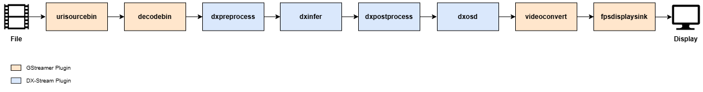

This section describes model inference for a single video stream.  
Although the example pipeline performs inference using the YOLOv7 model, it can be easily adapted to various vision tasks with different models. The pipeline below reads video frames from a file and performs a pre-infer-post process tailored to YOLOv7.  

The inference results are then drawn using `dxosd`, and the final output is displayed via a display sink.  

The pipeline in the figure is defined in 
`dx_stream/dx_stream/pipelines/single_network/object_detection/run_YOLOV7.sh` and can be used as a reference for execution.

When performing object detection on a single stream input, multi-object tracking can be enabled by adding dxtracker.
As shown below, by inserting the tracker after the YOLO object detection, detected objects can be tracked over time.

The pipeline in the figure is defined in 
`dx_stream/dx_stream/pipelines/tracking/run_YOLOV5S_tracker.sh` and can be used as a reference for execution.

### **Explanation**

**Element Descriptions**  

- **`urisourcebin`**: Specifies the input video file. The `uri` property **must** be set to the file path of the video you wish to process.  
- **`decodebin`**: Decodes the input video stream.  
- **`dxpreprocess`**: Applies pre-processing according to the configuration file specified in the `config-file-path`.  
- **`dxinfer`**: Runs inference using the YOLOv7 model. The model configuration file path is specified in `config-file-path`.  
- **`dxpostprocess`**: Post-processes the model's output tensor to extract metadata. The configuration file path is specified in `config-file-path`.  
- **`dxtracker`**: Tracks objects detected by the YOLO model using the OC-SORT algorithm.  
- **`dxosd`**: Draws object detection results (e.g., bounding boxes, class labels, etc.) on the video frames.  
- **`fpsdisplaysink`**: Displays the video frames along with the FPS (frames per second) information. The `sync=false` property ensures that all frames are displayed without being dropped.  

### **Usage Notes**  

**Custom Models**  

This pipeline is **not** limited to the YOLOv7 model. It can be easily adapted for other AI tasks by updating the corresponding model and configuration files.  

- **Classification**: Image classification tasks  
- **Segmentation**: Ppixel-wise semantic segmentation  
- **Pose Estimation**: Detecting human keypoints  

Update the `config-file-path` property in the `dxpreprocess`, `dxinfer`, and `dxpostprocess` elements to match your model’s configuration.  

**Pipeline Behavior**  

This pipeline runs synchronously because it does **not** include `queue` elements.  Each element waits for the previous one to finish processing before continuing.  This simplifies data flow but may affect performance on multi-core systems.  

**Sink Element Options**  

You can replace `fpsdisplaysink` with other display options.  

  - **`ximagesink`**: Displays video in an X11 window environment  
  - **`autovideosink`**:  Automatically selects the most suitable video sink for the platform  

**Object Detection Requirement**  

- The dxtracker element requires bounding box information. Therefore, object detection **must** precede tracking in the pipeline.

**Visualization**  

- The dxosd element overlays both detection and tracking results. Each object is assigned a unique track ID by the dxtracker element, which is visualized along with the bounding box.

**Buffer Handling**  

- In this example, `fpsdisplaysink` is set with `sync=false`, which means no frames are -dropped—all frames are displayed as-is.  
- If you want to sync playback with the original video frame rate or reduce latency, set `sync=true`.  

---
