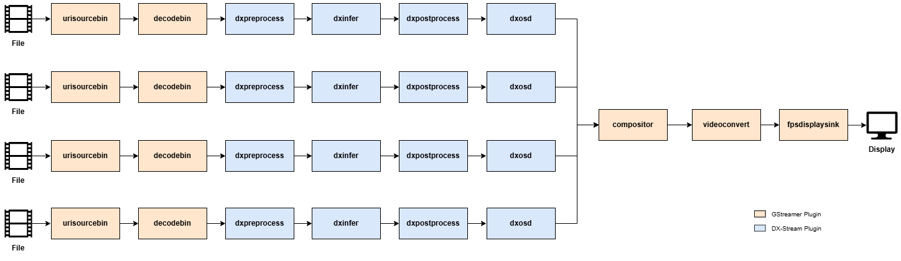
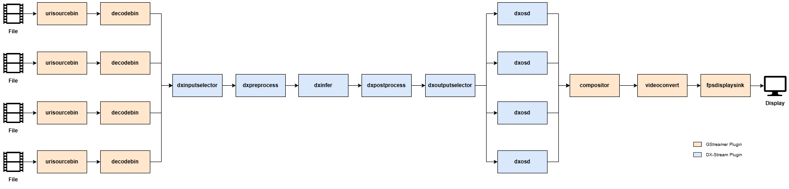

There are two possible approaches to building a pipeline structure for multi-stream inference.  

One approach is to configure an independent inference sub-pipeline for each stream, as shown in the figure below.  

In this case, each sub-pipeline performs inference asynchronously, maximizing the utilization of hardware resources.  

The pipeline in the figure is defined in 
`dx_stream/dx_stream/pipelines/multi_stream/run_multi_stream_YOLOV5S.sh` and can be used as a reference for execution.  

The other approach uses **DxInputSelector** and **DxOutputSelector**.  
**DxInputSelector** is an `N:1 ` element that receives buffers from multiple input streams and forwards the one with the smallest PTS downstream first.  
The selected buffer passes through a single inference pipeline for processing, and **DxOutputSelector** then redistributes the results back to their corresponding streams.  

The pipeline in the figure is defined in 
`dx_stream/dx_stream/pipelines/multi_stream/run_multi_stream_single_infer_YOLOV5S.sh` and can be used as a reference for execution.  

### **Explanation**  

**Element Descriptions**  

- **`conpositor`**: Draws multiple stream buffers received through sink pads at specified positions. In the example above, it is used for tiled display of inference results from each stream.  
- **`dxinputselector`**: Selects the buffer with the smallest PTS among multiple input streams received through sink pads and pushes it downstream. 
- **`dxoutputselector`**: Routes buffers received from upstream back into multiple output streams.  

### **Usage Notes**  

- Depending on the model size, using a multi sub-pipeline structure may put a burden on memory resources 
- While sub-pipeline structures can offer advantages in processing speed, the performance gain may be negligible compared to selector-based pipelines depending on the environment.

---
