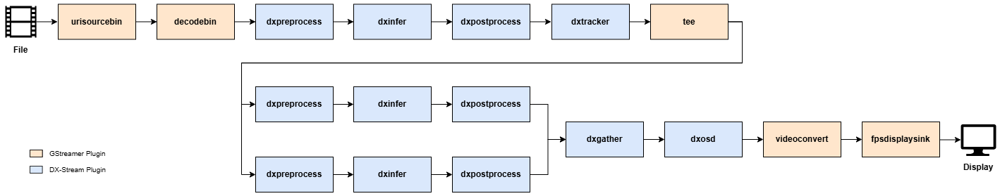

This section describes the secondary mode inference pipeline, which performs object-level inference based on objects detected in the primary mode. A single input stream is processed through primary inference for object detection, followed by tracking.  

Using a `tee` element, the buffer is duplicated into two streams.
One stream proceeds to secondary inference, where additional tasks such as face detection and Re-ID feature extraction are performed, with the results stored in each object’s metadata.  

Then, the `dxgather` element collects the outputs from the secondary inference streams and merges them into a single buffer, converting the data back into a unified stream.
Finally, the results are rendered for visualization.  

The pipeline in the figure is defined in 
`dx_stream/dx_stream/pipelines/secondary_mode/run_secondary_mode.sh` and can be used as a reference for execution.

### **Explanation**  

**Element Descriptions**  

- **`tee`**: Duplicates a single stream into multiple streams. The duplicated output buffers originate from the same source buffer.  
- **`dxgather`**: Merges buffers originating from the same source but split by tee, and combines their inference results into a single buffer. 

### **Usage Notes**  

**Configure file setting** 

- This pipeline runs three different models concurrently. Therefore, be careful to configure each model’s preprocess_id and inference_id properly to avoid unexpected behavior.

**Secondary post process**

- When implementing a custom post-processing function for secondary inference mode, modify the provided DXObjectMeta directly. Removing or re-allocating the metadata may lead to unintended behavior.

---
