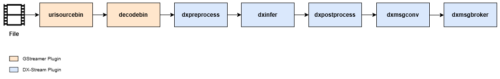

The pipeline demonstrates how to process a local video file with the YOLOv7 model for object detection, convert the results into a structured message format (e.g., JSON), and publish them to a message broker such as MQTT or Kafka for downstream applications.

## Basic MsgBroker Pipeline Process

This section demonstrates how to run a basic message broker pipeline demo using MQTT or Kafka



The pipeline in the figure is defined in 
`dx_stream/pipelines/broker/*.sh` and can be used as a reference for execution.

### **Explanation**

**Element Descriptions**  

- **`dxmsgconv`**: Transform element that processes inference metadata from upstream **DxPostprocess** elements and converts it into structured message payloads (typically JSON) using a user-defined custom library. The element requires a `library-file-path` property pointing to the custom message conversion library.
- **`dxmsgbroker`**: Sink element that transmits payload messages to external message brokers (MQTT or Kafka) using a **Broker Abstraction Layer (BAL)** that provides unified interface for different broker types. 

### **Usage Notes**  

**Pipeline Execution**  

- **Server Side**: Run the DX-STREAM pipeline with broker output on the processing server
- **Client Side**: Run the consumer application to receive and process messages

**Basic Properties**  

- **`dxmsgconv`**: Converts inference metadata to JSON format
- **`dxmsgbroker`**: Publishes messages to MQTT/Kafka broker

---

### **Quick Start Demo**

This section demonstrates how to run a basic message broker pipeline demo using MQTT or Kafka.

#### **MQTT Demo**

**1. Server Setup (Processing Server with Message Broker)**
```bash
# Install and start Mosquitto MQTT broker
sudo apt install mosquitto mosquitto-clients
sudo systemctl start mosquitto
sudo systemctl enable mosquitto
```

**2. Run DX-STREAM Pipeline (Server Side)**
```bash
# Execute the broker pipeline on processing server
# The pipeline uses YOLOv7 model for object detection and converts to JSON messages
cd /path/to/dx_stream
./pipelines/broker/run_dxmsgbroker_mqtt.sh

# Or run manually with custom settings
gst-launch-1.0 \
  urisourcebin uri=file:///path/to/your/video.mp4 ! decodebin ! \
  dxpreprocess config-file-path=configs/Object_Detection/YoloV7/preprocess_config.json ! \
  dxinfer config-file-path=configs/Object_Detection/YoloV7/inference_config.json ! \
  dxpostprocess config-file-path=configs/Object_Detection/YoloV7/postprocess_config.json ! \
  dxmsgconv library-file-path=/usr/lib/libdx_msgconvl.so config-file-path=configs/msgconv_config.json ! \
  dxmsgbroker broker-name=mqtt conn-info=localhost:1883 topic=test
```

**3. Client Application (Any Machine - Consumer Only)**
```bash
# Install Python MQTT client library (client machine only needs this)
pip install paho-mqtt

# Run the MQTT client to receive messages from server
python3 /usr/share/dx-stream/bin/mqtt_sub_example.py -n <server_ip> -p 1883 -t test

# Or for C++ version
mqtt_sub_example -h <server_ip> -t test -p 1883
```

#### **Kafka Demo**

**1. Server Setup (Processing Server with Message Broker)**
```bash
# Install Java and Kafka
sudo apt install default-jdk
wget https://downloads.apache.org/kafka/3.9.0/kafka_2.13-3.9.0.tgz
tar -xzf kafka_2.13-3.9.0.tgz
cd kafka_2.13-3.9.0

# Start Zookeeper and Kafka server
bin/zookeeper-server-start.sh config/zookeeper.properties &
bin/kafka-server-start.sh config/server.properties &
```

**2. Run DX-STREAM Pipeline (Server Side)**
```bash
# Execute the broker pipeline on processing server  
cd /path/to/dx_stream
./pipelines/broker/run_dxmsgbroker_kafka.sh

# Or run manually with custom settings
gst-launch-1.0 \
  urisourcebin uri=file:///path/to/your/video.mp4 ! decodebin ! \
  dxpreprocess config-file-path=configs/Object_Detection/YoloV7/preprocess_config.json ! \
  dxinfer config-file-path=configs/Object_Detection/YoloV7/inference_config.json ! \
  dxpostprocess config-file-path=configs/Object_Detection/YoloV7/postprocess_config.json ! \
  dxmsgconv library-file-path=/usr/lib/libdx_msgconvl.so config-file-path=configs/msgconv_config.json ! \
  dxmsgbroker broker-name=kafka conn-info=localhost:9092 topic=test
```

**3. Client Application (Any Machine - Consumer Only)**
```bash
# Install Python Kafka client library (client machine only needs this)
pip install kafka-python

# Run the Kafka client to receive messages from server
python3 /usr/share/dx-stream/bin/kafka_consume_example.py -n <server_ip> -p 9092 -t test

# Or for C++ version
kafka_consume_example -n <server_ip> -p 9092 -t test
```

#### **Network Architecture**

**Processing Server:**
- DX-STREAM Pipeline (dxmsgconv + dxmsgbroker)
- Message Broker Service (MQTT/Kafka)

**Client Machine:**
- Consumer Application (Python/C++)
- Only needs client library (paho-mqtt/kafka-python)
- No broker service needed

**Connection:** Processing Server ←→ Client Machine via network

**Requirements:**

- **Server**: DX-STREAM + Message Broker Service (MQTT/Kafka)

- **Client**: Only consumer application + client library (paho-mqtt/kafka-python)

!!! note "NOTE" 

    Replace `<server_ip>` with the actual IP address of your processing server. For local testing, use `localhost`.

#### **Pipeline Properties**

The broker pipelines use the following key properties:

**DxMsgConv Element:**

- `config-file-path`: Path to configuration file containing message format properties (optional)

- `library-file-path`: Path to custom message converter library (**required**)

- `message-interval`: Frame interval for message conversion (default: 1)

**DxMsgBroker Element:**

- `broker-name`: Message broker type - "mqtt" or "kafka" (**required**)

- `conn-info`: Connection string in format `host:port` (**required**)

- `topic`: Topic name for message publishing (**required**)

- `config`: Path to broker configuration file for advanced settings (optional)

---


## Advanced MsgBroker Configuration 

This section describes the detailed steps required to set up secure communication for the MQTT and Kafka message brokers, including SSL/TLS encryption and client authentication

### **MQTT Security Configuration**

#### **SSL/TLS Encryption Setup**

**1. Generate CA Certificate and Server Keys**
```bash
# Create Root CA
openssl genrsa -out ca.key 2048
openssl req -new -x509 -days 360 -key ca.key -out ca.crt -subj "/C=KR/ST=KK/L=SN/O=DXS/OU=Test/CN=TestCA"

# Create Server Certificate (CN must match hostname)
openssl genrsa -out server.key 2048
openssl req -new -out server.csr -key server.key -subj "/C=KR/ST=KK/L=SN/O=DXS/OU=Server/CN=DXS-BROKER"
openssl x509 -req -in server.csr -CA ca.crt -CAkey ca.key -CAcreateserial -out server.crt -days 360
openssl verify -CAfile ca.crt server.crt

# Create Client Certificate (for client authentication)
openssl genrsa -out client.key 2048
openssl req -new -out client.csr -key client.key -subj "/C=KR/ST=KK/L=SN/O=DXS/OU=Client/CN=DXS-CLIENT"
openssl x509 -req -in client.csr -CA ca.crt -CAkey ca.key -CAcreateserial -out client.crt -days 360
openssl verify -CAfile ca.crt client.crt

# Move certificates to mosquitto directories
sudo mkdir -p /etc/mosquitto/ca_certificates /etc/mosquitto/certs
sudo mv ca.crt /etc/mosquitto/ca_certificates/
sudo mv ca.key /etc/mosquitto/ca_certificates/
sudo mv server.crt server.key /etc/mosquitto/certs/
sudo mv client.crt client.key /etc/mosquitto/certs/

# Set correct ownership and permissions
sudo chown mosquitto:mosquitto /etc/mosquitto/ca_certificates/ca.crt
sudo chown mosquitto:mosquitto /etc/mosquitto/certs/server.crt /etc/mosquitto/certs/server.key
sudo chmod 644 /etc/mosquitto/ca_certificates/ca.crt
sudo chmod 600 /etc/mosquitto/ca_certificates/ca.key
sudo chmod 644 /etc/mosquitto/certs/server.crt
sudo chmod 600 /etc/mosquitto/certs/server.key
sudo chmod 644 /etc/mosquitto/certs/client.crt
sudo chmod 600 /etc/mosquitto/certs/client.key
```

**2. Configure Mosquitto Server**
```bash
# Edit /etc/mosquitto/mosquitto.conf
sudo tee /etc/mosquitto/mosquitto.conf << 'EOF'
# Basic settings
persistence true
persistence_location /var/lib/mosquitto/
log_dest file /var/log/mosquitto/mosquitto.log
include_dir /etc/mosquitto/conf.d

# Global auth settings (apply to all listeners)
allow_anonymous false
password_file /etc/mosquitto/passwd

# Plain MQTT port
listener 1883

# TLS MQTT port
listener 8883
cafile /etc/mosquitto/ca_certificates/ca.crt
certfile /etc/mosquitto/certs/server.crt
keyfile /etc/mosquitto/certs/server.key
require_certificate false
use_identity_as_username false
EOF
```

**3. Setup Authentication**
```bash
# Create user credentials
sudo mosquitto_passwd -b /etc/mosquitto/passwd user 1234
sudo chmod 644 /etc/mosquitto/passwd
sudo chown root:mosquitto /etc/mosquitto/passwd

# Restart mosquitto
sudo systemctl restart mosquitto
sudo systemctl status mosquitto
```

**4. Test Connection**
```bash
# Test plain MQTT (port 1883)
mosquitto_sub -h localhost -p 1883 -t test -u user -P 1234

# Test TLS MQTT (port 8883) - in another terminal
# For self-signed certificates, use --insecure option
mosquitto_sub -h localhost -p 8883 -t test -u user -P 1234 --cafile /etc/mosquitto/ca_certificates/ca.crt --insecure

# Publish test message
mosquitto_pub -h localhost -p 8883 -t test -u user -P 1234 --cafile /etc/mosquitto/ca_certificates/ca.crt --insecure -m "TLS test message"
```

**5. DxMsgBroker Configuration File**
Create `broker_mqtt.cfg`:
```ini
# Authentication
username = user
password = 1234

# Client ID (optional)
client-id = dx_stream_client

# SSL/TLS Configuration
tls_enable = 1
tls_insecure = 1
tls_cafile = /etc/mosquitto/ca_certificates/ca.crt
tls_capath = /etc/mosquitto/ca_certificates
tls_certfile = /etc/mosquitto/certs/client.crt
tls_keyfile = /etc/mosquitto/certs/client.key
```

**6. Modify DX-Stream Pipeline**

```
    gst-launch-1.0 -e urisourcebin uri=file://$INPUT_VIDEO_PATH ! $DECODE_PIPELINE ! \
                    dxpreprocess config-file-path=$SRC_DIR/configs/Object_Detection/YoloV7/preprocess_config.json ! queue ! \
                    dxinfer config-file-path=$SRC_DIR/configs/Object_Detection/YoloV7/inference_config.json ! queue ! \
                    dxpostprocess config-file-path=$SRC_DIR/configs/Object_Detection/YoloV7/postprocess_config.json ! queue ! \
                    dxmsgconv config-file-path=$SRC_DIR/configs/msgconv_config.json ! queue ! \
                    dxmsgbroker broker-name=mqtt conn-info=localhost:8883 topic=test config=$SRC_DIR/configs/broker_mqtt.cfg
```

---

### **Kafka Security Configuration**

#### **SSL/TLS Setup for Kafka**

**1. Generate Certificates for Kafka**
Follow the [librdkafka SSL guide](https://github.com/confluentinc/librdkafka/wiki/Using-SSL-with-librdkafka) for detailed certificate generation.

**2. Configure Kafka Server (server.properties)**
```properties
# SSL Configuration
ssl.protocol=TLS
ssl.enabled.protocols=TLSv1.2,TLSv1.1,TLSv1
ssl.keystore.type=JKS
ssl.keystore.location=/path/to/kafka.server.keystore.jks
ssl.keystore.password=server_keystore_password
ssl.key.password=server_key_password
ssl.truststore.type=JKS
ssl.truststore.location=/path/to/kafka.server.truststore.jks
ssl.truststore.password=server_truststore_password
ssl.client.auth=required
```

**3. DxMsgBroker Kafka Configuration**
Create `broker_kafka.cfg`:
```ini
[kafka]
# Message size limits
message.max.bytes=10485760

# SSL Configuration
security.protocol=ssl
ssl.ca.location=/path/to/ca-cert.pem
ssl.certificate.location=/path/to/client-cert.pem
ssl.key.location=/path/to/client-key.pem
ssl.key.password=client_key_password
```
