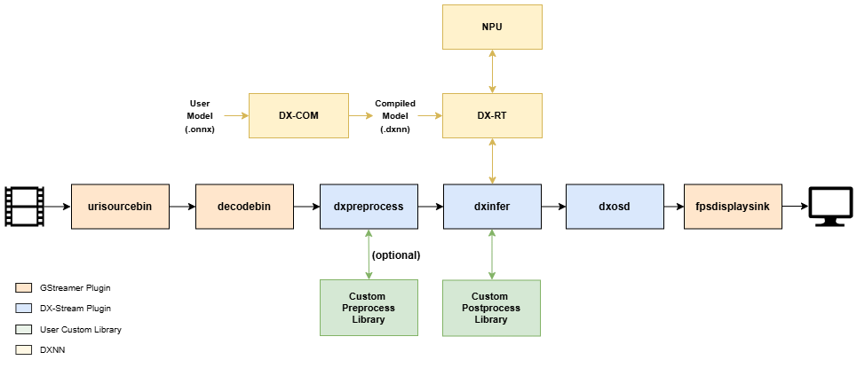

DX-Stream is a GStreamer Custom Plugin designed to simplify the development of Vision AI Applications using DEEPX's NPU in a GStreamer pipeline format.
DX-Stream enables rapid and efficient development of Vision AI Applications by providing a modular, pipeline-based framework powered by DEEPX's NPU. The customizable preprocessing, inference, and postprocessing elements ensure flexibility for a variety of AI scenarios.

## Key Features
**Pipeline Modularity**

- DX-Stream breaks down the data processing steps required for Vision AI Applications into discrete functional units called

**Elements**

- [**DxMuxer**](./elements/dxmuxer.md)
- [**DxPreprocess**](./elements/dxpreprocess.md)
- [**DxInfer**](./elements/dxinfer.md)
- [**DxPostprocess**](./elements/dxpostprocess.md)
- [**DxTracker**](./elements/dxtracker.md)
- [**DxOsd**](./elements/dxosd.md)
- [**DxRate**](./elements/dxrate.md)
- [**DxGather**](./elements/dxgather.md)
- [**DxTiler**](./elements/dxtiler.md)
- [**DxMsgbroker**](./elements/dxmsgbroker.md)
- [**DxMsgconv**](./elements/dxmsgconv.md)

**Inference Workflow**

- The combination of `[DxPreprocess] -> [DxInfer] -> [DxPostprocess]` forms the core of AI model inference.

**Custom Library Support**

- **DxPreprocess** and **DxPostprocess** elements support custom libraries for applying various pre-processing and post-processing procedures tailored to different AI models.

**Efficient AI Inference**

- **DxInfer** handles model execution by leveraging the computational power of DEEPX's NPU.
- Model inference requires a `.dxnn` model file, which is generated using **DX-COM (Compiler)**.

---

## Model Workflow

**Model Compilation**

- DX-COM converts `.onnx` model files into `.dxnn` format, optimized for DEEPX NPU execution.

**Model Execution**

- The `.dxnn` file is loaded onto the NPU.
- The host system utilizes **DXRT (Runtime)** to:

    Allocate computation tasks to the NPU.
    Provide input tensors.
    Receive output tensors (inference results).

**Inference Process**

- The actual computations for deep learning model inference are offloaded to the NPU.

---

## Getting Started

This section provides an example of quickly running DX-Stream's sample pipelines in a Docker environment.

**Requirements**

Ensure the NPU Driver must be installed

To follow this guide, you will need:

- **DX-Stream Docker Image File**  
  (e.g., `dxstream_vX.X.X_amd64_ubuntu20.04.tar`)
- **`dk` Command File**  
  (A utility file to simplify Docker operations for DX-Stream)
    ```
    Usage:
    Build Images : ./dk build <DX_RT_TAR_PATH>
    Load Images : ./dk load <image tar file>
    Run Container : ./dk run
    Remove Container & images : ./dk rmi
    ```

**Steps to Run**

- Install Docker

    Refer to [Section 2](./installation.md) for detailed instructions on installing Docker.

- Load Docker Image

    Use the `dk` command to load the DX-Stream Docker image:

    ```
    $ ./dk load ./dxstream_vX.X.X_amd64_ubuntu20.04.tar
    ```

- Run Docker Container

    Run the Docker container using the following command:

    ```
    $ ./dk run
    ```

- Run the Demo

    Inside the running container, execute the demo script:

    ```
    # cd /deepx/dx-runtime/dx_stream
    # ./setup.sh
    # ./run_demo.sh
    ```

    When the script runs, you'll be prompted to choose a demo from the following options:

    ```
    0: Object Detection (YOLOv7)
    1: Multi-Object Tracking
    2: Pose Estimation
    3: Semantic Segmentation
    4: Multi-Channel Object Detection
    5: Multi-Channel RTSP
    6: secondary mode
    which AI demo do you want to run:(timeout:10s, default:0)
    ```
    Enter the number corresponding to the desired demo to run it.
    
    If no input is provided within 10 seconds, the default option (0: Object Detection) will execute.

**Notes**

- Each demo corresponds to a pipeline described in [Section 5](./pipelines/object_detection.md).

- Ensure all prerequisites (e.g., Docker installation, DX-Stream image, and dk command file) are in place before proceeding.

---
