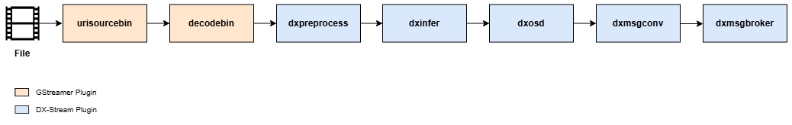

The following pipeline demonstrates how to process a video file using the YOLOv7 model for object detection, visualize the results, convert metadata into a message format, and publish the messages to a broker server:



```bash
gst-launch-1.0 \
urisourcebin uri=file:///path/to/your/video_file ! \
decodebin ! \
dxpreprocess config-file-path=/path/to/YOLOv7/preprocess_config.json ! queue ! \
dxinfer config-file-path=/path/to/YOLOv7/infer_config.json ! queue ! \
dxpostprocess config-file-path=/path/to/YOLOv7/postprocess_config.json ! queue ! \
dxosd ! queue ! \
dxmsgconv config-file-path=/path/to/msgconv_config.json ! queue ! \
dxmsgbroker broker-name=[broker] conn-info=[host]:[port] topic=topic_name
```

### **Explanation**

**Pipeline Overview**:
This pipeline processes a video file, performs object detection using the YOLOv7 model, overlays the results on the video frames, converts the detection metadata into a specified message format, publishes the messages.

---

**Element Descriptions**

- **`urisourcebin`**: Specifies the input video file. The `uri` property must be set to the file path of the video you wish to process.
- **`decodebin`**: Decodes the video file into raw video frames.
- **`dxpreprocess`**: Applies pre-processing according to the configuration file specified in the `config-file-path`.
- **`dxinfer`**: Performs inference using the YOLOv7 model. The model configuration file path is specified in `config-file-path`.
- **`dxpostprocess`**: Post-processes the model's output tensor to extract metadata. The configuration file path is specified in `config-file-path`.
- **`dxosd`**: Visualizes the detection results, including bounding boxes, class labels, and confidence scores, by overlaying them on the video frames.
- **`dxmsgconv`**: Converts the metadata generated by dxpostprocess into a specific message format defined in the configuration file specified by config-file-path.
- **`dxmsgbroker`**: Publishes the messages to a broker server. The broker-name(`mqtt` or `kafka`),  connection info (`[host]:[port]`) and topic name must be provided.

---

### **Usage Notes**

**Input Video File**
- Replace `file:///path/to/your/video_file` with the full path to the video file you wish to process.

**Metadata Conversion**
- The `dxmsgconv` element requires a configuration file to define the message format. Update the `config-file-path` property to point to your message conversion configuration file.

**Message Publishing**
- The `dxmsgbroker` element requires:

  **`conn-info`**: Connection information for the broker in the format `[host]:[port]`.

  **`topic`**: The topic name for publishing the messages.

**Asynchronous Processing**
- `queue` elements between the processing stages enable asynchronous operation, improving pipeline performance.
- Configure `queue` properties such as `max-size-buffers` and `leaky` to fine-tune performance.

**Custom Models**
- This pipeline can be adapted for other object detection models or tasks by updating the `config-file-path` properties for `dxpreprocess`, `dxinfer`, `dxpostprocess`, and `dxmsgconv`.

**Visualization**
- The `dxosd` element overlays the detection results for visual confirmation during processing. If visualization is not needed, it can be removed from the pipeline.

### **Broker Server Application**

**MQTT**

MQTT (Message Queuing Telemetry Transport) is a lightweight, publish/subscribe messaging protocol.
For more information about setting up MQTT, please refer to [here](./broker_mqtt.md).

And for secure connection, you need to set the config file of dxmsgbroker as follows.

- broker_mqtt.cfg
  ```
  ### username / password
  #username = user
  #password = 1234
  
  ### client-id, if not defined a random client idwill be generated
  ##client-id = client1
  
  ### enable ssl/tls encryption
  tls_enable = 1
  
  ### the PEM encoded Certificate Authority certificates
  #tls_cafile = <path to CA certificate file>
  
  ### the path to a file containing the CA certificates, 'openssl rehash <path to capath>' each time   you add/remove a certificate.
  tls_capath = <path to directroy containing CA certificates>
  
  ### Path to the PEM encoded client certificate.
  tls_certfile = <path to certificate file>
  
  ### Path to the PEM encoded client certificate.
  tls_keyfile = <path to key file>
  ```

**Kafka**

Apache Kafka is a distributed event streaming platform designed for high-throughput, fault-tolerant, and scalable handling of real-time data streams. For more information about setting up Kafka, please refer to [here](./broker_kafka.md).

And for secure connection, you need to set the config file of dxmsgbroker as follows.

- broker_kafka.cfg
  ```
  #######################################
  ### kafka client configuration
  #######################################
  [kafka]
  ### for frame data
  message.max.bytes=10485760
  
  
  ### for secure transmission
  #security.protocol=ssl
  ## CA certificate file for verifying the broker's certificate.
  ssl.ca.location=<path to CA certificate file>
  
  ## Client's certificate
  ssl.certificate.location=<path to client certificate file>
  
  ## Client's key
  ssl.key.location=<path to client key file>
  
  ## Key password, if any
  ssl.key.password=KEY_PASSWORD
  ```

**Script Descriptions**

The server application, which receives data from the MQTT, KAFKA pipeline to log messages or render images, can be found in /usr/share/dx-stream/bin.

- mqtt_sub_example.py (mqtt_sub_example)

    Runs an MQTT server that logs the messages received.

- mqtt_sub_example_frame.py

    Displays frames included in the messages using OpenCV.
    (Note: The include_frame option in the DxMsgConv config JSON must be set to true for this feature to work.)

- kafka_consume_example.py (kafka_consume_example)

    Runs an KAFKA server that logs the messages received.

- kafka_consume_example_frame.py

    Displays frames included in the messages using OpenCV.
    (Note: The include_frame option in the DxMsgConv config JSON must be set to true for this feature to work.)

