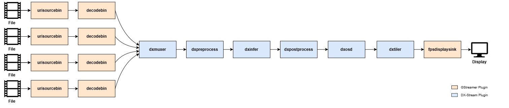

The following pipeline demonstrates how to process four video streams simultaneously using the YOLOv7 model for object detection and visualize the results as a tiled display:



```
gst-launch-1.0 \
urisourcebin uri=file:///path/to/your/video_file ! decodebin ! mux.sink_0 \
urisourcebin uri=file:///path/to/your/video_file ! decodebin ! mux.sink_1 \
urisourcebin uri=file:///path/to/your/video_file ! decodebin ! mux.sink_2 \
urisourcebin uri=file:///path/to/your/video_file ! decodebin ! mux.sink_3 \
dxmuxer name=mux live-source=false ! \
dxpreprocess config-file-path=/path/to/YOLOv7/preprocess_config.json ! \
dxinfer config-file-path=/path/to/YOLOv7/infer_config.json ! \
dxosd ! \
dxtiler config-file-path=/path/to/tiler_config.json ! \
fpsdisplaysink sync=false
```

---

### **Explanation**

**Pipeline Overview**
- This pipeline processes four separate video streams, detects objects using the YOLOv7 model, and combines the results into a single tiled display for visualization.

**Element Descriptions**

- **`urisourcebin`**: Specifies the input video files. Each `urisourcebin` instance corresponds to one video file.
- **`decodebin`**: Decodes the video streams.
- **`dxmuxer`**: Combines multiple video streams into a single stream.

    `live-source=false`: Indicates non-live sources (e.g., video files).

- **`dxpreprocess`**: Applies pre-processing according to the configuration file specified in the `config-file-path`.
- **`dxinfer`**: Performs inference using the YOLOv7 model. The model configuration file path is specified in `config-file-path`.
- **`dxosd`**: Visualizes the detection results, including bounding boxes, class labels, and confidence scores, by overlaying them on the video frames.
- **`dxtiler`**: Arranges the frames from all input streams into a grid layout for display. The configuration file path is specified in `config-file-path`.
- **`fpsdisplaysink`**: Displays the tiled video frames. The `sync=false` property ensures no frames are dropped.

---

### **Usage Notes**

**Multi-Stream Configuration**

- **`dxmuxer`**

    - Combines multiple input streams into one. In this example, four streams are connected.
    - The `name` property must be set (e.g., `mux` in this example).
    - The sink pads for `dxmuxer` must follow the format `[name].sink_[index]`, where `index` is a consecutive integer starting from 0.
    - In this example

        `mux.sink_0`: First input stream.

        `mux.sink_1`: Second input stream.

        `mux.sink_2`: Third input stream.

        `mux.sink_3`: Fourth input stream.

**Tiling the Output**

- **`dxtiler`**

    Combines frames from multiple streams into a single large frame arranged in a grid.
    
    The grid configuration (e.g., rows and columns) is defined in the configuration file specified in `config-file-path`.

**Custom Models**

- This pipeline can be adapted for other object detection models by updating the `config-file-path` properties for `dxpreprocess`, `dxinfer`, and `dxpostprocess`.

**Sink Element Options**

- While `fpsdisplaysink` is used in this example, other sink elements like `ximagesink` or `autovideosink` can be used for display, depending on your environment.
