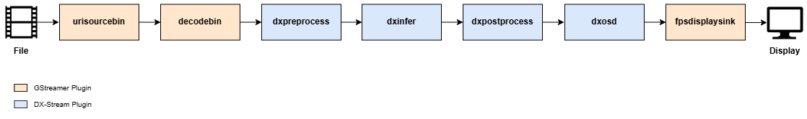

The following example pipeline demonstrates how to run the YOLOv7 model and visualize the results:



```
gst-launch-1.0 \
urisourcebin uri=file:///path/to/your/video_file ! \
decodebin ! \
dxpreprocess config-file-path=/path/to/YOLOv7/preprocess_config.json ! \
dxinfer config-file-path=/path/to/YOLOv7/infer_config.json ! \
dxosd ! \
fpsdisplaysink sync=false
```

---

### **Explanation**

**Pipeline Overview**:

- This pipeline processes a video file using the YOLOv7 model for object detection, performs pre-processing, inference, post-processing, and overlays results on the video frame for visualization.

**Element Descriptions**:

- **`urisourcebin`**: Specifies the input video file. The `uri` property must be set to the file path of the video you wish to process.
- **`decodebin`**: Decodes the input video stream.
- **`dxpreprocess`**: Applies pre-processing according to the configuration file specified in the `config-file-path`.
- **`dxinfer`**: Runs inference using the YOLOv7 model. The model configuration file path is specified in `config-file-path`.
- **`dxosd`**: Draws object detection results (e.g., bounding boxes, class labels, etc.) on the video frames.
- **`fpsdisplaysink`**: Displays the video frames along with the FPS (frames per second) information. The `sync=false` property ensures that all frames are displayed without being dropped.

---

### **Usage Notes**

**Custom Models**:

- This pipeline structure is not limited to the YOLOv7 model. It can be adapted for other tasks like:

    **Classification**: Image classification tasks.

    **Segmentation**: Pixel-level segmentation tasks.

    **Pose Estimation**: Human pose estimation tasks.

- Update the `config-file-path` properties for `dxpreprocess` and `dxinfer` elements to point to the appropriate configuration files for your model.

**Pipeline Behavior**:

- Since no `queue` elements are used, the pipeline operates synchronously. Elements process data sequentially, and downstream elements wait for upstream processing to complete.

**Sink Element Options**:

- Replace `fpsdisplaysink` with other sink elements like:

    - **`ximagesink`**: To display video on an X11 window.

    - **`autovideosink`**: Automatically selects a suitable video sink for the environment.

**Buffer Handling**:

- In this example, `fpsdisplaysink` has `sync=false`, meaning all frames are displayed without dropping any buffers. Adjust this setting depending on your application requirements.
