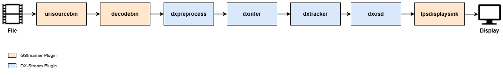

The following pipeline demonstrates how to run the YOLOv7 model for object detection, apply the OC-SORT algorithm for object tracking, and visualize the results:



```
gst-launch-1.0 \
urisourcebin uri=file:///path/to/your/video_file ! \
decodebin ! \
dxpreprocess config-file-path=/path/to/YOLOv7/preprocess_config.json ! \
dxinfer config-file-path=/path/to/YOLOv7/infer_config.json ! \
dxpostprocess config-file-path=/path/to/YOLOv7/postprocess_config.json ! \
dxtracker ! \
dxosd ! \
fpsdisplaysink sync=false
```

---

### **Explanation**

**Pipeline Overview**

- This pipeline processes a video file, detects objects using the YOLOv7 model, tracks objects using the OC-SORT algorithm, and overlays the tracking results on the video frames for visualization.

**Element Descriptions**

- **`urisourcebin`**: Specifies the input video file. The `uri` property must be set to the file path of the video you wish to process.
- **`decodebin`**: Decodes the input video stream.
- **`dxpreprocess`**: Applies pre-processing according to the configuration file specified in the `config-file-path`.
- **`dxinfer`**: Runs inference using the YOLOv7 model. The model configuration file path is specified in `config-file-path`.
- **`dxpostprocess`**: Post-processes the model's output tensor to extract metadata. The configuration file path is specified in `config-file-path`.
- **`dxtracker`**: Tracks objects detected by the YOLOv7 model using the OC-SORT algorithm.
- **`dxosd`**: Draws detection and tracking results (e.g., bounding boxes, class labels, track IDs, etc.) on the video frames.
- **`fpsdisplaysink`**: Displays the video frames along with the FPS (frames per second) information. The `sync=false` property ensures that all frames are displayed without being dropped.

---

### **Usage Notes**

**Object Detection Requirement**

- The `dxtracker` element requires bounding box information to function. Therefore, object detection must precede tracking in the pipeline.
- Ensure that the `dxpreprocess` and `dxinfer` elements are configured with the appropriate configuration files for an object detection model (e.g., YOLOv7).

**Visualization**

- The `dxosd` element overlays both detection and tracking results. Each object is assigned a unique track ID by the `dxtracker` element, which is visualized along with the bounding box.

**Buffer Handling**

- The `fpsdisplaysink` element is set to `sync=false`, ensuring that no frames are dropped, and all tracking results are visualized.

**Sink Element Options**

- Replace `fpsdisplaysink` with other sink elements like:

    **`ximagesink`**: To display video on an X11 window.
    
    **`autovideosink`**: Automatically selects a suitable video sink for the environment.