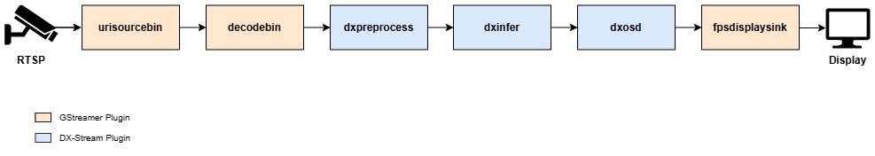

The following pipeline demonstrates how to process an RTSP video stream in real-time using the YOLOv7 model for object detection and visualize the results:



```
gst-launch-1.0 \
urisourcebin uri=rtsp://[ip_address]:[port]/[stream_path] ! \
decodebin ! \
dxpreprocess config-file-path=/path/to/YOLOv7/preprocess_config.json ! \
dxinfer config-file-path=/path/to/YOLOv7/infer_config.json ! \
dxosd ! \
fpsdisplaysink sync=true
```

---

### **Explanation**

**Pipeline Overview**

- This pipeline processes an RTSP video stream, runs object detection using the YOLOv7 model, and overlays the results on the video frames for real-time display.

**Element Descriptions**

- **`urisourcebin`**: Retrieves the video stream from the RTSP source. The `uri` property must be set to the RTSP URL (e.g., `rtsp://[ip_address]:[port]/[stream_path]`).
- **`decodebin`**: Decodes the video stream from the RTSP source.
- **`dxpreprocess`**: Applies pre-processing according to the configuration file specified in the config-file-path.
- **`dxinfer`**: Performs inference using the YOLOv7 model. The model configuration file path is specified in `config-file-path`.
- **`dxosd`**: Visualizes the detection results, including bounding boxes, class labels, and confidence scores, by overlaying them on the video frames.
- **`fpsdisplaysink`**: Displays the video frames with synchronization (`sync=true`) to match the real-time playback timing.

---

### **Usage Notes**

**RTSP URL**

- Replace `[ip_address]`, `[port]`, and `[stream_path]` in the `uri` property with the RTSP stream's address, port, and path.

**Synchronization**

- The `fpsdisplaysink` element is set to `sync=true`, ensuring that the display output is synchronized with the timestamps of the video stream.
- This may cause frames to drop if the system cannot keep up with real-time processing.

**Frame Dropping**

- Since `sync=true`, frames may be dropped based on buffer timestamps to maintain synchronization with real-time playback.

**Custom Models**

- You can adapt this pipeline to other object detection models or tasks by updating the `config-file-path` properties for `dxpreprocess` and `dxinfer` to point to the appropriate configuration files.

**Sink Element Options**

- While `fpsdisplaysink` is used in this example, other sink elements like `ximagesink` or `autovideosink` can be used for display, depending on your environment.
