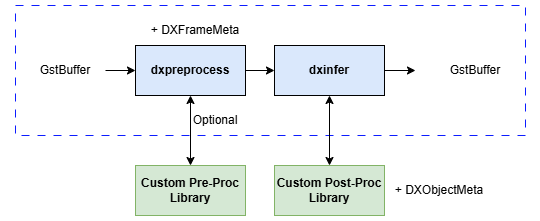

# Writing Your Own Application

This section explains the process required to use a custom model for inference within the DX-Stream framework. It assumes the model has already been compiled into `.dxnn` format using **DX-COM**. For details on model compilation, refer to the **DX-COM Documentation**.

---

## Custom Library for Model Inference



The inference pipeline in DX-Stream is composed of the following elements:

**dxpreprocess**  

- Allocates `DXFrameMeta` based on the `GstBuffer` received from upstream and performs the preprocessing algorithm set via properties.
- For custom preprocessing algorithms, a **Custom Pre-Process Library** can be built and integrated.
- See the **dxpreprocess** section in the Elements documentation for details.

**dxinfer**  

- Uses the `input tensor` created by `dxpreprocess` and performs inference via **DX-RT**.
- Refers to the `output tensor` created by `DX-RT` and executes the postprocessing algorithm defined in a custom library.
- Custom postprocessing is required for each model.
- Examples for common vision tasks can be found in `/usr/share/dx-stream/src/dx_stream/custom_library`.

---

### **Writing Custom Pre-Process Function**

For models requiring additional preprocessing beyond the default functionality, implement the preprocessing logic using a **Custom Pre-Process Library**.

#### **Implementation Example**
```
extern "C" void AlignFace(cv::Mat originFrame, DXNetworkInput &network_input,
                          DXObjectMeta *object_meta) 
{
    // Preprocessing logic
}
```

- **DXObjectMeta**:
  - In **Secondary Mode**, metadata for each object is passed to the preprocessing logic.
  - In **Primary Mode**, no metadata is passed (`nullptr`).

- **DXNetworkInput**:
  - The processed data must be written to the memory location provided by this type.
  - Ensure that the image size processed by the custom library matches the size set in `GstDxPreprocess`.

#### **Library Integration**
Build the custom library using a `meson.build` script:

```
dx_stream_dep = declare_dependency(
    include_directories : include_directories('/usr/local/include/dx_stream'),
    link_args : ['-L/usr/local/lib', '-lgstdxstream'],
)

gst_dep = dependency('gstreamer-1.0', version : '>=1.14',
    required : true, fallback : ['gstreamer', 'gst_dep'])

opencv_dep = dependency('opencv4', required: true)

yolo_preprocess_lib = shared_library('preprocess_face_recognition', 
    'preprocess.cpp',
    dependencies: [opencv_dep, gst_dep, dx_stream_dep],
    install: true,
    install_dir: plugins_install_dir + '/lib'
)
```
Specify the library path and function name in the JSON configuration file for `dxpreprocess`:
```
{
    "library_file_path": "./install/gstreamer-1.0/lib/libpreprocess_face_recognition.so",
    "function_name": "AlignFace"
}
```
---

### **Writing Custom Post-Process Function**

Postprocessing is essential for parsing the model's output tensor. A custom library is required to handle postprocessing specific to the model.

#### **Output Tensor Parsing**

Use **DXRT's `parse_model`** command to check the output tensor shape of the compiled model:

```
$ parse_model -m YOLOv7.dxnn

Example output:

outputs:
  onnx::Reshape_491, FLOAT, [1, 80, 80, 256]
  onnx::Reshape_525, FLOAT, [1, 40, 40, 256]
  onnx::Reshape_559, FLOAT, [1, 20, 20, 256]
```

The example shows three blobs with NHWC dimensions. Use this information to implement the custom postprocessing logic.

#### **Implementation Example**
```
extern "C" void YOLOV5S_1(std::vector<shared_ptr<dxrt::Tensor>> network_output,
                          DXFrameMeta *frame_meta, DXObjectMeta *object_meta)
{
    // Convert output tensor to bounding box information
}
```
#### **Library Integration**

Build the custom library using a `meson.build` script:

```
project('postprocess_yolov5s', 'cpp', version : '1.0.0', license : 'LGPL', default_options: ['cpp_std=c++11'])

dx_stream_dep = declare_dependency(
    include_directories : include_directories('/usr/local/include/dx_stream'),
    link_args : ['-L/usr/local/lib', '-lgstdxstream'],
)

dxrt_dep = declare_dependency(
    include_directories : include_directories('/usr/local/include'),
    link_args : ['-L/usr/local/lib', '-ldxrt'],
)

gst_dep = dependency('gstreamer-1.0', version : '>=1.14',
    required : true, fallback : ['gstreamer', 'gst_dep'])

opencv_dep = dependency('opencv4', required: true)

yolo_postprocess_lib = shared_library('postprocess_yolo', 
    'postprocess.cpp',
    dependencies: [opencv_dep, gst_dep, dx_stream_dep, dxrt_dep],
    install: true,
    install_dir: '/usr/share/dx-stream/lib'
)
```

Specify the library path and function name in the JSON configuration file for `dxinfer`:

```
{
    "library_file_path": "./install/gstreamer-1.0/lib/libyolo_postprocess.so",
    "function_name": "yolo_post_process"
}
```

---

### **Differences in Post-Processing Logic Based on Inference Mode**

**Primary Mode**:  

- Inference is performed on the entire frame.
- Postprocessing creates new objects (`DXObjectMeta`) and adds them to `DXFrameMeta`.

**Secondary Mode**:  

- Postprocessing focuses on modifying or adding properties to existing objects.
- The input object meta (`DXObjectMeta *object_meta`) has a exist object information, and object metadata is passed for modification.

---

## Custom Message Convert Library

Custom message conversion requires implementing a library that converts metadata into the desired message format.

#### **Functions to Implement**
**dxmsg_create_context**:

- Initializes the context using a configuration file.
**dxmsg_delete_context**:

- Deletes the context and frees resources.
**dxmsg_convert_payload**:

- Converts metadata into the desired message format.
**dxmsg_release_payload**:

- Releases payload resources.

#### **Implementation Example**

```
#include "dx_msgconvl_priv.hpp"

extern "C" DxMsgContext *dxmsg_create_context(const gchar *file) {
    DxMsgContext *context = g_new0(DxMsgContext, 1);
    context->_priv_data = (void *)dxcontext_create_contextPriv();
    dxcontext_parse_json_config(file, (DxMsgContextPriv *)context->_priv_data);
    return context;
}

extern "C" void dxmsg_delete_context(DxMsgContext *context) {
    dxcontext_delete_contextPriv((DxMsgContextPriv *)context->_priv_data);
    g_free(context);
}

extern "C" DxMsgPayload *dxmsg_convert_payload(DxMsgContext *context, DxMsgMetaInfo *meta_info) {
    DxMsgPayload *payload = g_new0(DxMsgPayload, 1);
    gchar *json_data = dxpayload_convert_to_json(context, meta_info);
    payload->_size = strlen(json_data);
    payload->_data = json_data;
    return payload;
}

extern "C" void dxmsg_release_payload(DxMsgContext *context, DxMsgPayload *payload) {
    g_free(payload->_data);
    g_free(payload);
}
```

#### **Library Integration**

Build the custom library:

```
custom_msgconv_lib = shared_library('custom_msgconv', 
    'dx_msgconvl.cpp',
    include_directories: [include_directories('.')],
    install: true,
    install_dir: '/opt/dx_stream/msgconv/lib'
)
```